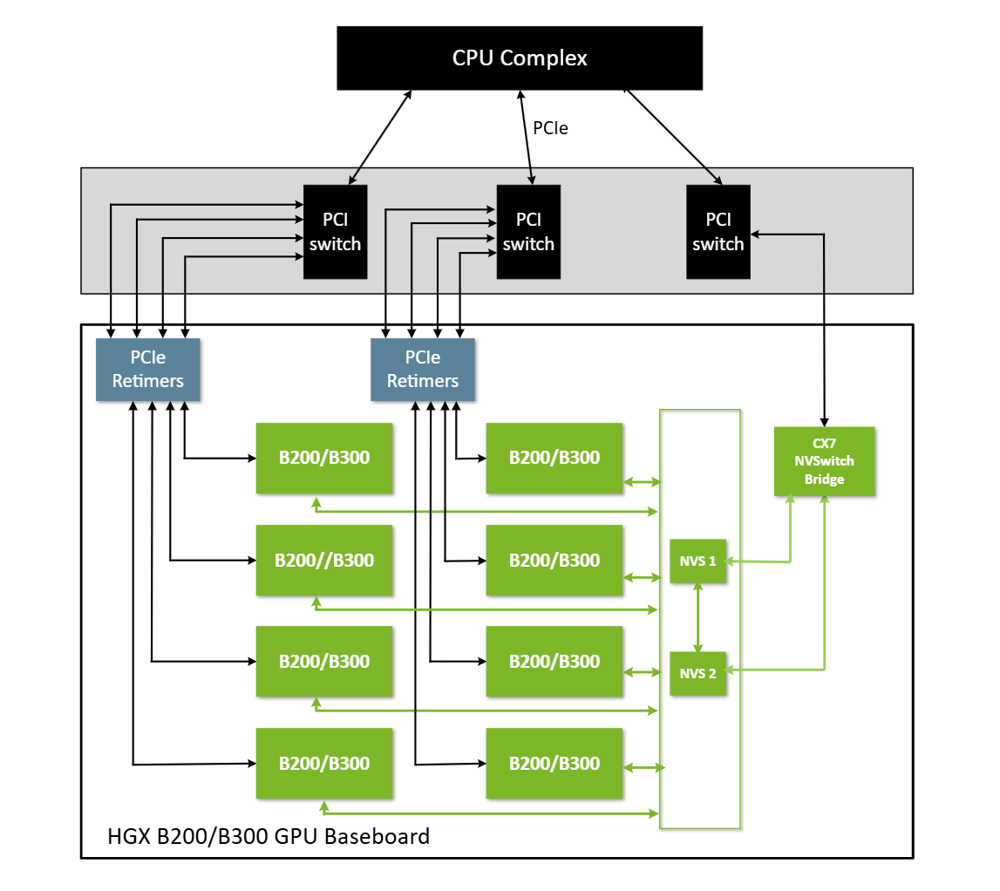
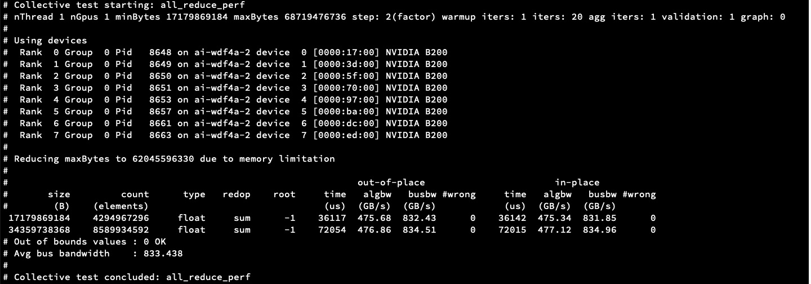
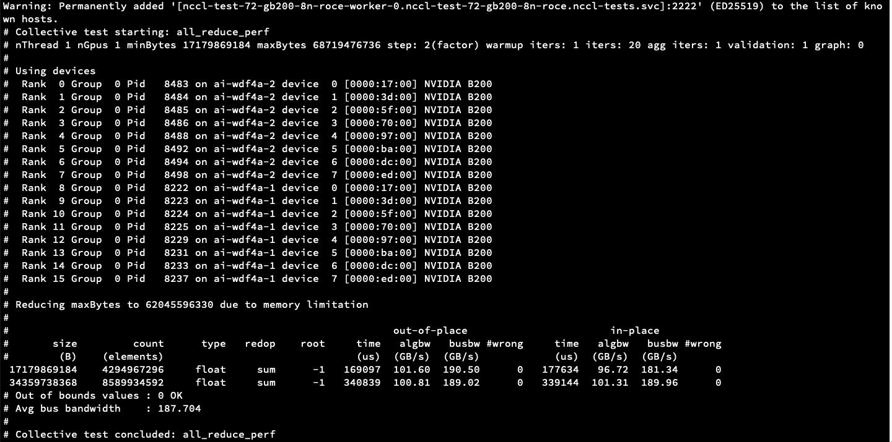

# Enable Blackwell Architecture with RDMA/RoCE support

## Table of Contents

- [Architecture Overview](#architecture)
  - [PCIe Device list](#pcie-devices)
- [Installation Steps](#installation-guide)
  - [1. Install GPU Operator](#1-install-gpu-operator)
  - [2. Verify Installation](#2-verify-installation)
- [Testing](#testing)
  - [Run RDMA Bandwidth Test](#run-rdma-bandwidth-test)
  - [Run NCCL Test](#run-nccl-test)
- [Technical Details](#technical-details)
  - [Kernel Configuration Changes](#kernel-config-changes)
  - [Kernel Parameters](#kernel-parameter)
  - [Fabric Manager Support](#fabric-manager-support)
- [Troubleshooting](#troubleshooting)
  - [Modules](#modules-loaded)
  - [RDMA status](#rdma-status)
  - [Common Errors](#errors)

---

## Architecture



In B200s (Blackwell Architecture), **NVLink/NVSwitch is not listed as a PCIe device**. Instead, the ConnectX controller that connects to NVLink is listed.

### PCIe Devices

To verify the PCIe devices, log in to the node and run:

```bash
lspci | grep -i -E 'nvidia|mellanox'
```

Expected output:
```text
17:00.0 3D controller: NVIDIA Corporation GB100 [B200] (rev a1)
18:00.0 Ethernet controller: Mellanox Technologies MT43244 BlueField-3 integrated ConnectX-7 network controller (rev 01)
18:00.1 DMA controller: Mellanox Technologies MT43244 BlueField-3 SoC Management Interface (rev 01)
3d:00.0 3D controller: NVIDIA Corporation GB100 [B200] (rev a1)
3e:00.0 Ethernet controller: Mellanox Technologies MT43244 BlueField-3 integrated ConnectX-7 network controller (rev 01)
3e:00.1 DMA controller: Mellanox Technologies MT43244 BlueField-3 SoC Management Interface (rev 01)
4e:00.0 Ethernet controller: Mellanox Technologies MT43244 BlueField-3 integrated ConnectX-7 network controller (rev 01)
4e:00.1 DMA controller: Mellanox Technologies MT43244 BlueField-3 SoC Management Interface (rev 01)
5f:00.0 3D controller: NVIDIA Corporation GB100 [B200] (rev a1)
60:00.0 Ethernet controller: Mellanox Technologies MT43244 BlueField-3 integrated ConnectX-7 network controller (rev 01)
60:00.1 DMA controller: Mellanox Technologies MT43244 BlueField-3 SoC Management Interface (rev 01)
70:00.0 3D controller: NVIDIA Corporation GB100 [B200] (rev a1)
71:00.0 Ethernet controller: Mellanox Technologies MT43244 BlueField-3 integrated ConnectX-7 network controller (rev 01)
71:00.1 DMA controller: Mellanox Technologies MT43244 BlueField-3 SoC Management Interface (rev 01)
97:00.0 3D controller: NVIDIA Corporation GB100 [B200] (rev a1)
98:00.0 Ethernet controller: Mellanox Technologies MT43244 BlueField-3 integrated ConnectX-7 network controller (rev 01)
98:00.1 DMA controller: Mellanox Technologies MT43244 BlueField-3 SoC Management Interface (rev 01)
ab:00.0 Infiniband controller: Mellanox Technologies MT2910 Family [ConnectX-7]
ab:00.1 Infiniband controller: Mellanox Technologies MT2910 Family [ConnectX-7]
ab:00.2 Infiniband controller: Mellanox Technologies MT2910 Family [ConnectX-7]
ab:00.3 Infiniband controller: Mellanox Technologies MT2910 Family [ConnectX-7]
ba:00.0 3D controller: NVIDIA Corporation GB100 [B200] (rev a1)
bb:00.0 Ethernet controller: Mellanox Technologies MT43244 BlueField-3 integrated ConnectX-7 network controller (rev 01)
bb:00.1 DMA controller: Mellanox Technologies MT43244 BlueField-3 SoC Management Interface (rev 01)
dc:00.0 3D controller: NVIDIA Corporation GB100 [B200] (rev a1)
dd:00.0 Ethernet controller: Mellanox Technologies MT43244 BlueField-3 integrated ConnectX-7 network controller (rev 01)
dd:00.1 DMA controller: Mellanox Technologies MT43244 BlueField-3 SoC Management Interface (rev 01)
ed:00.0 3D controller: NVIDIA Corporation GB100 [B200] (rev a1)
ee:00.0 Ethernet controller: Mellanox Technologies MT43244 BlueField-3 integrated ConnectX-7 network controller (rev 01)
ee:00.1 DMA controller: Mellanox Technologies MT43244 BlueField-3 SoC Management Interface (rev 01)
```

## Installation Guide

### 1 Install gpu operator 

B200 supports only open kernel module, below helm command installs the gpu operator with necessary nvidia drivers

```
helm upgrade --install -n gpu-operator gpu-operator nvidia/gpu-operator --values \
  https://raw.githubusercontent.com/gardenlinux/gardenlinux-nvidia-installer/refs/heads/main/helm/gpu-operator-values.yaml \
  --set driver.repository=ghcr.io/gardenlinux/gardenlinux-nvidia-installer/open --set driver.rdma.useHostMofed=true
```

### 2 Verify Installation

After successful installtion of gpu operator, we should see all the pods running healthy

```
kubectl get pods -n nvidia-system
gardener-node-feature-discovery-worker-*               1/1     Running     
gpu-feature-discovery-*                                1/1     Running
nvidia-container-toolkit-daemonset-*                   1/1     Running
nvidia-cuda-validator-*                                0/1     Completed
nvidia-dcgm-exporter-*                                 1/1     Running
nvidia-device-plugin-daemonset-*                       1/1     Running
nvidia-driver-daemonset-6.12.72-amd64-gardenlinux0-*   1/1     Running
nvidia-mig-manager-*                                   1/1     Running
nvidia-operator-validator-*                            1/1     Running
```
If cuda validator fails, then might be fabric manager (check [Fabric Manager support](#fabric-manager-support))

### Testing

#### Run RDMA bandwidth test

##### RDMA Test Pod Configuration

<details>
<summary><b>Node1</b></summary>

```yaml
apiVersion: v1
kind: Pod
metadata:
  name: rdma-test-node1
spec:
  nodeSelector:
    kubernetes.io/hostname: <node1>
  restartPolicy: OnFailure
  hostNetwork: true
  containers:
  - name: rdma-test
    image: mellanox/cuda-perftest
    securityContext:
      privileged: true
      capabilities:
        add: [ "IPC_LOCK" ]
    resources:
      limits:
        nvidia.com/gpu: 1
      requests:
        nvidia.com/gpu: 1
    volumeMounts:
    - name: dev-infiniband
      mountPath: /dev/infiniband
    - name: sys
      mountPath: /sys
    command: ["sleep", "infinity"]
  volumes:
  - name: dev-infiniband
    hostPath:
      path: /dev/infiniband
      type: DirectoryOrCreate
  - name: sys
    hostPath:
      path: /sys
      type: Directory
```
</details>
<details>
<summary><b>Node2</b></summary>

```yaml
apiVersion: v1
kind: Pod
metadata:
  name: rdma-test-node2
spec:
  nodeSelector:
    kubernetes.io/hostname: <node2>
  restartPolicy: OnFailure
  hostNetwork: true
  containers:
  - name: rdma-test
    image: mellanox/cuda-perftest
    securityContext:
      privileged: true
      capabilities:
        add: [ "IPC_LOCK" ]
    resources:
      limits:
        nvidia.com/gpu: 1
      requests:
        nvidia.com/gpu: 1
    volumeMounts:
    - name: dev-infiniband
      mountPath: /dev/infiniband
    - name: sys
      mountPath: /sys
    command: ["sleep", "infinity"]
  volumes:
  - name: dev-infiniband
    hostPath:
      path: /dev/infiniband
      type: DirectoryOrCreate
  - name: sys
    hostPath:
      path: /sys
      type: Directory
```
</details>

##### Start pods
```bash
kubectl apply -f <rdma_test_node1.yaml> -n rdma-test
kubectl apply -f <rdma_test_node2.yaml> -n rdma-test
```

##### 3 Run test inside pod
**In Terminal 1 (server):**
```bash
kubectl exec -it rdma-test-node1 -n rdma-test -- ib_write_bw --use_cuda=0 --use_cuda_dmabuf \
    -d mlx5_0 -a -F --report_gbits -q 1
```
**Output**
```
************************************
* Waiting for client to connect... *
************************************
```

**In Terminal 2 (client):**
```bash
kubectl exec -it rdma-test-node2 -n rdma-test -- ib_write_bw --use_cuda=0 --use_cuda_dmabuf \
    -d mlx5_0 -a -F --report_gbits -q 1 <ip_address>
```
**Output**
```
---------------------------------------------------------------------------------------
                    RDMA_Write BW Test
 Dual-port       : OFF		Device         : mlx5_0
 Number of qps   : 1		Transport type : IB
 Connection type : RC		Using SRQ      : OFF
 PCIe relax order: ON
 ibv_wr* API     : ON
 CQ Moderation   : 1
 Mtu             : 4096[B]
 Link type       : Ethernet
 GID index       : 3
 Max inline data : 0[B]
 rdma_cm QPs	 : OFF
 Data ex. method : Ethernet
---------------------------------------------------------------------------------------
 local address: LID 0000 QPN 0x0e2e PSN 0xf3aa42 RKey 0x186dc0 VAddr 0x007fad682b4000
 GID: 00:00:00:00:00:00:00:00:00:00:255:255:10:00:01:11
 remote address: LID 0000 QPN 0x1d81 PSN 0xe9c73e RKey 0x186d4a VAddr 0x007f62137fa000
 GID: 00:00:00:00:00:00:00:00:00:00:255:255:10:00:01:12
---------------------------------------------------------------------------------------
 #bytes     #iterations    BW peak[Gb/sec]    BW average[Gb/sec]   MsgRate[Mpps]        BW min[Gb/sec]
 65536      5000             368.67             368.48 		   0.702829		  0.00
---------------------------------------------------------------------------------------
```
Test can be repeated for other rdma interfaces

#### Run nccl-test

##### Start mpi operator 
```
kubectl apply -f https://raw.githubusercontent.com/kubeflow/mpi-operator/v0.3.0/deploy/v2beta1/mpi-operator.yaml
```

##### Configuration file
<details>
<summary><b>Pod Definition</b></summary>

```yaml
apiVersion: kubeflow.org/v2beta1
kind: MPIJob
metadata:
  name: nccl-test-72-gb200-8n-roce
spec:
  slotsPerWorker: 8
  runPolicy:
    cleanPodPolicy: Running
  mpiReplicaSpecs:
    Launcher:
      replicas: 1
      template:
        metadata:
        spec:
          hostNetwork: true
          dnsPolicy: ClusterFirstWithHostNet
          containers:
            - name: nccl
              image: ghcr.io/coreweave/nccl-tests:13.1.0-devel-ubuntu24.04-nccl2.29.2-1-9dd6f94 
              command: ["/bin/bash", "-c"]
              args:
                - |
                  # Copy SSH keys with correct permissions
                  mount -o remount,rw /root/.ssh
                  cp -rL /mnt/ssh-secret/* /root/.ssh/
                  chmod 700 /root/.ssh
                  chmod 600 /root/.ssh/id_rsa
                  chmod 644 /root/.ssh/id_rsa.pub /root/.ssh/authorized_keys 2>/dev/null || true
                  sed -i 's/^Port 22$/Port 2222/; s/^#Port 22$/Port 2222/' /etc/ssh/sshd_config
                  sleep infinity 
              env:
                - name: OMPI_ALLOW_RUN_AS_ROOT
                  value: "1"
                - name: OMPI_ALLOW_RUN_AS_ROOT_CONFIRM
                  value: "1"
                - name: OMPI_MCA_plm_rsh_args
                  value: "-p 2222"
                - name: LD_LIBRARY_PATH
                  value: "/usr/local/cuda/lib64:/run/nvidia/driver/lib:/run/nvidia/driver/usr/lib/x86_64-linux-gnu:${LD_LIBRARY_PATH}"
              resources:
                requests:
                  cpu: 2
                  memory: 32Gi
                limits:
                  memory: 64Gi
              securityContext:
                privileged: true
              volumeMounts:                          
                - name: ssh-secret
                  mountPath: /mnt/ssh-secret
                  readOnly: true
                - name: nvidia-driver-bin
                  mountPath: /usr/local/nvidia/bin
                  readOnly: true
                - name: nvidia-driver-lib
                  mountPath: /run/nvidia/driver
                  readOnly: true
                - name: dshm
                  mountPath: /dev/shm 
          volumes:                                  
            - name: ssh-secret
              secret:
                secretName: nccl-test-72-gb200-8n-roce-ssh
                defaultMode: 0600
            - name: nvidia-driver-bin
              hostPath:
                path: /run/nvidia/driver/bin
                type: Directory
            - name: nvidia-driver-lib
              hostPath:
                path: /run/nvidia/driver
                type: Directory
            - name: dshm                       
              emptyDir:                       
                medium: Memory                  
                sizeLimit: 300Gi  
          restartPolicy: Never

    Worker:
      replicas: 2
      template:
        metadata:
          labels:
            metadata.coreweave.cloud/job: nccl-test
          annotations:
            io.kubernetes.cri.shm-size: "500Gi"
        spec:
          hostNetwork: true
          dnsPolicy: ClusterFirstWithHostNet
          affinity:
            podAntiAffinity:
              requiredDuringSchedulingIgnoredDuringExecution:
                - labelSelector:
                    matchLabels:
                      training.kubeflow.org/job-name: nccl-test-72-gb200-8n-roce
                      training.kubeflow.org/replica-type: worker
                  topologyKey: kubernetes.io/hostname
          containers:
            - name: nccl
              image: ghcr.io/coreweave/nccl-tests:13.1.0-devel-ubuntu24.04-nccl2.29.2-1-9dd6f94
              command: ["/bin/bash", "-c"]
              args:
                - |
                  mount -o remount,rw /root/.ssh
                  cp -rL /mnt/ssh-secret/* /root/.ssh/
                  chmod 700 /root/.ssh
                  chmod 600 /root/.ssh/id_rsa
                  chmod 644 /root/.ssh/id_rsa.pub /root/.ssh/authorized_keys 2>/dev/null || true
                  
                  sed -i 's/^Port 22$/Port 2222/; s/^#Port 22$/Port 2222/' /etc/ssh/sshd_config
                  service ssh start && sleep infinity
              env:
                - name: LD_LIBRARY_PATH
                  value: "/usr/local/cuda/lib64:/run/nvidia/driver/lib:/run/nvidia/driver/usr/lib/x86_64-linux-gnu:${LD_LIBRARY_PATH}"
              resources:
                requests:
                  nvidia.com/gpu: 8
                  memory: 1500Gi
                limits:
                  nvidia.com/gpu: 8
                  memory: 1500Gi
              volumeMounts:
                - mountPath: /dev/shm
                  name: dshm
                - mountPath: /dev/infiniband
                  name: infiniband
                - name: ssh-secret                  
                  mountPath: /mnt/ssh-secret
                  readOnly: true
                - name: nvidia-driver-bin
                  mountPath: /usr/local/nvidia/bin
                  readOnly: true
                - name: nvidia-driver-lib
                  mountPath: /run/nvidia/driver
                  readOnly: true
              securityContext:
                privileged: true
          volumes:
            - emptyDir:
                medium: Memory
                sizeLimit: 500Gi
              name: dshm
            - hostPath:
                path: /dev/infiniband
                type: Directory
              name: infiniband
            - name: ssh-secret                       
              secret:
                secretName: nccl-test-72-gb200-8n-roce-ssh
                defaultMode: 0600
            - name: nvidia-driver-bin
              hostPath:
                path: /run/nvidia/driver/bin
                type: Directory
            - name: nvidia-driver-lib
              hostPath:
                path: /run/nvidia/driver
                type: Directory
```
</details>
Note this test is using host network in privileged mode. It is less secure. We should use SRIOV instead with NVIDIA network operator

##### Run test pods
```bash
kubectl apply -f nccl-test.yaml -n nccl-tests
```
##### Observer pods running
```
kubectl get pods -n nccl-tests

kubectl get pods -n nccl-tests
NAME                                       READY   STATUS    RESTARTS   AGE
nccl-test-72-gb200-8n-roce-launcher-*                1/1     Running   0          4m39s
nccl-test-72-gb200-8n-roce-worker-0         1/1     Running   0          4m39s
nccl-test-72-gb200-8n-roce-worker-1         1/1     Running   0          4m39s
```

#### Run mpirun command inside launcher
```
kubectl exec -it -n nccl-tests nccl-test-72-gb200-8n-roce-launcher-* -- bash
```
**For Intra node**
```
mpirun -np 8 -N 8 --bind-to none --map-by slot \
  --mca oob_tcp_if_include <mngt_interface>  \
  --mca btl_tcp_if_include <mgmt_interface>   \
  --mca pml ucx   \
  --mca plm_rsh_args "-p 2222 -o StrictHostKeyChecking=no -o UserKnownHostsFile=/dev/null"  \
  --hostfile /etc/mpi/hostfile   \
  -x LD_LIBRARY_PATH   \
  -x NCCL_DEBUG=INFO   \
  -x NCCL_DEBUG_SUBSYS=NET,INET,GRAPH   \
  -x NCCL_IB_GID_INDEX=3 \
  -x NCCL_SOCKET_IFNAME=<mgmt_interface>   \
  -x OMPI_MCA_coll_hcoll_enable=0   \
  -x NCCL_IB_HCA=^mlx5_2,mlx5_6,mlx5_7,mlx5_8,mlx5_9 \
  -x UCX_NET_DEVICES=mlx5_0:1,mlx5_1:1,mlx5_3:1,mlx5_4:1,mlx5_5:1,mlx5_10:1,mlx5_11:1,mlx5_12:1 \
  /opt/nccl_tests/build/all_reduce_perf -b 16G -e 64G -f 2 -g 1
```
**Output**


**For Inter node**
```
mpirun -np 16 -N 8 --bind-to none --map-by slot \
  --mca oob_tcp_if_include <mngt_interface>  \
  --mca btl_tcp_if_include <mgmt_interface>   \
  --mca pml ucx   \
  --mca plm_rsh_args "-p 2222 -o StrictHostKeyChecking=no -o UserKnownHostsFile=/dev/null"  \
  --hostfile /etc/mpi/hostfile   \
  -x LD_LIBRARY_PATH   \
  -x NCCL_DEBUG=INFO   \
  -x NCCL_DEBUG_SUBSYS=NET,INET,GRAPH   \
  -x NCCL_IB_GID_INDEX=3 \
  -x NCCL_SOCKET_IFNAME=<mgmt_interface>   \
  -x OMPI_MCA_coll_hcoll_enable=0   \
  -x NCCL_IB_HCA=^mlx5_2,mlx5_6,mlx5_7,mlx5_8,mlx5_9 \
  -x UCX_NET_DEVICES=mlx5_0:1,mlx5_1:1,mlx5_3:1,mlx5_4:1,mlx5_5:1,mlx5_10:1,mlx5_11:1,mlx5_12:1 \
  /opt/nccl_tests/build/all_reduce_perf -b 16G -e 64G -f 2 -g 1
```
**Output*


## Technical Details

### Kernel Config changes
#### Soft RoCE/RXE
```
CONFIG_INFINIBAND_VIRT_DMA=y
CONFIG_RDMA_RXE=m
CONFIG_INFINIBAND_IPOIB=m
CONFIG_INFINIBAND_IPOIB_CM=y
CONFIG_NET_UDP_TUNNEL=y
```
#### RDMA/RoCE/DMABuf support
```
CONFIG_PCI_P2PDMA=y
CONFIG_DMABUF_MOVE_NOTIFY=y
CONFIG_UDMABUF=y
CONFIG_HMM_MIRROR=y
CONFIG_DEVICE_PRIVATE=y
CONFIG_RDMA_CORE=y
```
### Kernel parameter
#### Kernel parameter to support DMABuf

Enabling iommu does some optimisation hence this need to be passthrough. Add below param in kernel cmdline

``` intel_iommu=on iommu=pt ```

### Fabric Manager support
#### Check for NVLink Status (Inside Node)

When Fabric manager is not installed properly, Fabric status shows In Progress
```
/run/nvidia/driver/bin/nvidia-smi -q -i 0 | grep -i -A 2 Fabric
         Fabric
            State                   : In Progress
            Status                  : N/A
```
Unlike other architecture, B200s needs NVLink installation. This can be done with 

```/usr/bin/nvidia-fabricmanager-start.sh --mode start --fm-config-file /etc/fabricmanager.cfg```

After successfull installation of Fabric Manager, status should be success

```
/run/nvidia/driver/bin/nvidia-smi -q -i 0 | grep -i -A 2 Fabric
    Fabric
        State                                          : Completed
        Status                                         : Success
```

## Troubleshooting

Below Section provides some details on the changes made on kernel or nvidia installer to support b200. Also some debugging section

### RDMA Status
If all the required modules installed for rdma, then rdma link show gives below output
```
rdma link show
link mlx5_0/1 state ACTIVE physical_state LINK_UP netdev ens112f0np0
link mlx5_1/1 state ACTIVE physical_state LINK_UP netdev ens113f0np0
link mlx5_2/1 state ACTIVE physical_state LINK_UP netdev ens121f0np0
link mlx5_3/1 state ACTIVE physical_state LINK_UP netdev ens114f0np0
link mlx5_4/1 state ACTIVE physical_state LINK_UP netdev ens115f0np0
link mlx5_5/1 state ACTIVE physical_state LINK_UP netdev ens116f0np0
link mlx5_6/1 subnet_prefix fe80:0000:0000:0000 lid 1 sm_lid 1 lmc 0 state ACTIVE physical_state LINK_UP
link mlx5_7/1 subnet_prefix fe80:0000:0000:0000 lid 4 sm_lid 1 lmc 0 state ACTIVE physical_state LINK_UP
link mlx5_8/1 subnet_prefix fe80:0000:0000:0000 lid 5 sm_lid 1 lmc 0 state ACTIVE physical_state LINK_UP
link mlx5_9/1 subnet_prefix fe80:0000:0000:0000 lid 6 sm_lid 1 lmc 0 state ACTIVE physical_state LINK_UP
link mlx5_10/1 state ACTIVE physical_state LINK_UP netdev ens117f0np0
link mlx5_11/1 state ACTIVE physical_state LINK_UP netdev ens118f0np0
link mlx5_12/1 state ACTIVE physical_state LINK_UP netdev ens119f0np0
```

### Modules loaded 

Modules required for NVIDIA driver, Mellanox, RDMA

```
lsmod | grep -i -E 'nvidia|mlx|rdma|ib'
rdma_ucm               36864  17
rdma_cm               155648  1 rdma_ucm
ib_cm                 155648  1 rdma_cm
nvidia_uvm           2117632  148
nvidia              16232448  2380 nvidia_uvm
mlx5_ib               491520  816
ib_uverbs             204800  2378 rdma_ucm,mlx5_ib
mlx5_core            2494464  1 mlx5_ib
mlxfw                  36864  1 mlx5_core
ib_umad                40960  18
ib_core               524288  7 rdma_cm,iw_cm,ib_umad,rdma_ucm,ib_uverbs,mlx5_ib,ib_cm
drm                   770048  8 gpu_sched,drm_kms_helper,drm_exec,drm_gpuvm,drm_display_helper,nvidia,drm_ttm_helper,ttm
```

## Errors
**Error Message**
```
UCX  ERROR Failed to allocate memory pool (name=rc_recv_desc) chunk: Input/output error
```
**Reason**
Default pinned memory is limited to 64M by default.

**Solution**
Increase MEMLock
```bash
/etc/systemd/system/containerd.service.d/override.conf
[Service]
LimitMEMLOCK=infinity
```

Restart daemon
```bash
systemctl daemon-reload
systemctl restart containerd
```
