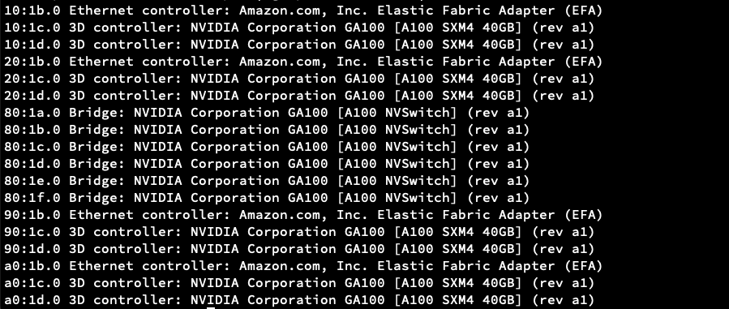
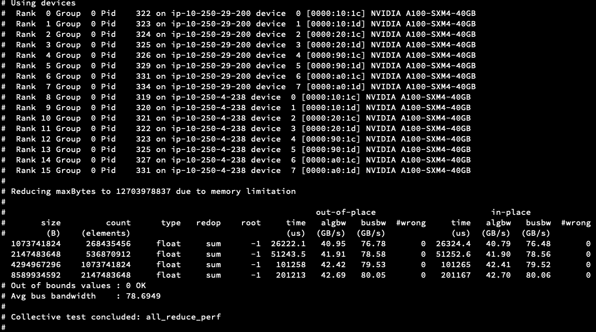

# Compiling and deploying NVIDIA GPU drivers on different Linux distributions

This document explains how use NVIDIA GPU drivers with a custom kernel or a non-standard Linux distribution, using
Garden Linux as the reference OS for all configurations and setup steps.

Some parts of this documentation are already implemented in the repository, and the Garden Linux configurations are
already in place. This document serves as a reference for the overall approach and as a debugging guide if issues arise.

## Introduction to Garden Linux

Garden Linux is a Debian GNU/Linux derivative that provides small, auditable Linux images for most major cloud
providers (e.g. AWS, Azure, GCP) and bare-metal machines. It is the recommended Linux distribution for Gardener nodes
and offers a highly customizable feature set to suit a wide range of use cases.

Garden Linux always supports the latest LTS Linux kernel.

## Introduction to the GPU Operator

Kubernetes provides access to special hardware resources such as NVIDIA GPUs, NICs, InfiniBand adapters, and other
devices through its device plugin framework. However, configuring and managing nodes with these resources requires
coordinating multiple software components such as drivers, container runtimes, libraries, and this can be a complex and
error-prone process. The NVIDIA GPU Operator uses the Kubernetes operator framework to automate the management of all
NVIDIA software components needed to provision GPUs. These components include the NVIDIA drivers (to enable CUDA), the
Kubernetes device plugin for GPUs, the NVIDIA Container Toolkit, automatic node labeling via GFD, DCGM-based monitoring,
and more.

The GPU Operator supports two driver installation modes:

- Downloading a pre-built driver image from the NVCR registry and installing the drivers inside the OS.
- Installing custom-built drivers from a custom location using a user-provided container image.

This document uses the second approach: building a custom container image to install NVIDIA drivers into the OS at a
non-default path. This is particularly useful when the root filesystem is read-only.

## NVIDIA Drivers and Open or Proprietary code

NVIDIA provides both proprietary and open kernel modules. This document uses the open kernel module.

### Supported GPUs: Proprietary vs. Open Kernel Module

Not every GPU is compatible with the open-source GPU kernel modules.

For cutting-edge platforms such as NVIDIA Grace Hopper or NVIDIA Blackwell, the open-source kernel modules are required.
The proprietary drivers are not supported on these platforms.

For newer GPUs from the Turing, Ampere, Ada Lovelace, or Hopper architectures, NVIDIA recommends switching to the
open-source kernel modules.

For older GPUs from the Maxwell, Pascal, or Volta architectures, the open-source kernel modules are not compatible.
Continue using the NVIDIA proprietary driver.

For mixed deployments containing both older and newer GPUs in the same machine, continue using the proprietary driver.
For clusters containing a mixture of older and newer GPUs where each machine has only one type of GPU, then the GPU
operator will by default choose the most appropriate kernel module type.

## NVIDIA Driver Components

At a minimum, two components must be installed to support an NVIDIA GPU.

### NVIDIA Driver Module

The kernel module that enables GPU support.

### Fabric Manager

When a node contains multiple GPUs, Fabric Manager is required to enable GPU-to-GPU communication and to scale
performance. It brings up NVSwitch or NVLink, the interconnects used for direct GPU-to-GPU communication.

## Building the NVIDIA Driver

The following is one example of how to build the driver; other approaches are also valid.

The container image must:

- Download the driver installer
- Extract the driver
- Run the NVIDIA installer to install driver modules to a custom path
- Copy the required firmware files
- Download and install Fabric Manager for the target GPU architecture

### Download the Driver Installer

The NVIDIA installer can be downloaded from https://www.nvidia.com/en-us/drivers/ - select Linux as the OS and choose
the appropriate GPU series.

``` Ex: https://uk.download.nvidia.com/tesla/<driver-version>/NVIDIA-Linux-<arch>-<driver-version>.run ```

### Extract the Driver

After downloading, extract the driver using the options below. This step extracts the contents without installing them.

```bash
chmod +x NVIDIA-Linux-<arch>-<driver-version>.run
./NVIDIA-Linux-<arch>-<driver-version>.run -x -s
#This extracts a folder with below name
cd ./NVIDIA-Linux-<arch>-<driver-version>
./nvidia-installer --kernel-module-type=open --kernel-name=<kernel-name> --kernel-install-path=<custom-path>/lib/modules/<kernel-name>
```

**Note:**

- kernel-name : Name of the kernel where installer should expect kernel headers inside /usr/lib.
- Make sure kernel headers match the system where the drivers will be installed finally. Otherwise loading driver module
  can result in error.

### Copy Firmware Files

In addition to the driver module itself, firmware files must be copied to the node. When the driver module is loaded, it
attempts to load the firmware. Ensure that firmware signing is disabled in the kernel configuration (
see [Disable Firmware Signing](#disable-firmware-signing)), or sign the firmware files before deploying.

```bash
mkdir -p <custom-path>/lib/firmware/nvidia/<driver-version>/
cp NVIDIA-Linux-<arch>-<driver-version>/firmware/* <custom-path>/lib/firmware/nvidia/<driver-version>/
```

After these steps, the NVIDIA driver is available at the custom path.

Now, create a container image that bundles the drivers built above and includes an installation script that performs the
following steps on startup (see [Install Driver](#install-driver)
and [Install Fabric Manager](#download-and-install-fabric-manager)).

### Install Driver

```bash
echo -n "<custom-path>/lib/firmware/" > /sys/module/firmware_class/parameters/path
modprobe -q -d "<custom-path>" nvidia
modprobe -q -d "<custom-path>" nvidia-uvm
<custom-path>/bin/nvidia-modprobe -u -m -c 0
```

### Download and Install Fabric Manager

Before installing Fabric Manager, review the [Architecture and Fabric Manager](#architecture-and-fabric-manager) section
to understand which components apply to your hardware.

#### Download Fabric Manager

```bash
wget -O /tmp/keyring.deb https://developer.download.nvidia.com/compute/cuda/repos/debian12/x86_64/cuda-keyring_1.1-1_all.deb && dpkg -i /tmp/keyring.deb
apt-get update
apt-get install -y -V nvidia-fabricmanager-<driver-major-version>=<driver-version>
```

#### Install Fabric Manager

For architectures using NVSwitch (e.g., Ampere):

```bash
sed -i 's/DAEMONIZE=1/DAEMONIZE=0/g' /etc/fabricmanager.cfg
sed -i 's/LOG_FILE_NAME=.*$/LOG_FILE_NAME=/g' /etc/fabricmanager.cfg
nv-fabricmanager -c /etc/fabricmanager.cfg
```

For architectures using NVLink/NVLSM (e.g. Blackwell):

```bash
apt-get install -y -V nvlsm
sed -i 's/DAEMONIZE=1/DAEMONIZE=0/g' /etc/fabricmanager.cfg
sed -i 's/LOG_FILE_NAME=.*$/LOG_FILE_NAME=/g' /etc/fabricmanager.cfg
/usr/bin/nvidia-fabricmanager-start.sh --mode start --fm-config-file /etc/fabricmanager.cfg
```

**Note:** Driver download and container image creation are fully automated in this repository for supported Garden Linux
versions.

# Installing Drivers with the GPU Operator

The previous section produced a container image that compiles and installs the NVIDIA driver. The next step is to pass
this image to the gpu-operator so it can install the driver on each node.

The GPU Operator is deployed via a Helm chart.

## Update Helm Values

```bash
cdi:
  enabled: true
  default: true
toolkit:
  installDir: /opt/nvidia
driver:
  imagePullPolicy: Always
  usePrecompiled: true
  version: <driver-major-version>
  repository: <container-image-name>
```

## Start the GPU Operator

```bash
helm repo add nvidia https://helm.ngc.nvidia.com/nvidia
helm repo update
helm upgrade --install gpu-operator nvidia/gpu-operator -n gpu-operator --create-namespace -f helm/gpu-operator-values.yaml
```

Once the GPU Operator is running, all of the following pods should be present:

```bash
kubectl get pods -n gpu-operator
gardener-node-feature-discovery-worker-*               1/1     Running
gpu-feature-discovery-*                                1/1     Running
nvidia-container-toolkit-daemonset-*                   1/1     Running
nvidia-cuda-validator-*                                0/1     Completed
nvidia-dcgm-exporter-*                                 1/1     Running
nvidia-device-plugin-daemonset-*                       1/1     Running
nvidia-driver-daemonset-6.12.72-amd64-gardenlinux0-*   1/1     Running
nvidia-mig-manager-*                                   1/1     Running
nvidia-operator-validator-*                            1/1     Running
```

## Architecture and Fabric Manager

(Reference: https://docs.nvidia.com/datacenter/tesla/fabric-manager-user-guide/index.html)

Fabric Manager configures the NVSwitch memory fabrics to form a unified memory fabric across all participating GPUs and
monitors the NVLinks that support the fabric. At a high level, Fabric Manager performs the following tasks:

Configures routing (for generations earlier than the fourth-generation NVSwitch) among NVSwitch ports.

Sets up GPU routing and port maps where applicable.

Coordinates with the GPU driver to initialize GPUs.

Monitors the fabric for NVLink and NVSwitch errors.

On systems that do not support Autonomous Link Initialization (ALI)-based NVLink training (first and second generation
NVSwitch-based systems), FM also performs the following tasks:

Coordinates with the NVSwitch driver to initialize and train NVSwitch-to-NVSwitch NVLink interconnects.

Coordinates with the GPU driver to initialize and train NVSwitch-to-GPU NVLink interconnects.

Whether NVSwitch or NVLink is used depends on the GPU architecture.

Example: A100 (with NVSwitch):


This can also be confirmed with lspci. TODO: Add snapshot from A100

Example: B200 (with NVLink):


This can also be confirmed with lspci:

```bash
lspci | grep -i -E 'connect'
```

Expected output:

```text
ab:00.0 Infiniband controller: Mellanox Technologies MT2910 Family [ConnectX-7]
```

### Check NVLink Status (Inside a Node)

When Fabric Manager is not installed correctly, the fabric status shows "In Progress":

```
/run/nvidia/driver/bin/nvidia-smi -q -i 0 | grep -i -A 2 Fabric
         Fabric
            State                   : In Progress
            Status                  : N/A
```

After a successful Fabric Manager installation, the status should show "Completed":

```
/run/nvidia/driver/bin/nvidia-smi -q -i 0 | grep -i -A 2 Fabric
    Fabric
        State                                          : Completed
        Status                                         : Success
```

## GPU Direct RDMA Support

GPUDirect RDMA is an NVIDIA technology that enables direct data exchange between GPUs and third-party peer devices over
PCI Express. Supported peer devices include network interfaces such as NVIDIA ConnectX SmartNICs, BlueField DPUs, and
video acquisition adapters.

GPU Direct RDMA can be enabled using either the NVIDIA `peermem` module or DMABuf. If using `peermem`, it must be built
and loaded within the container image install script described above. Since NVIDIA recommends using the open kernel
module with DMABuf, the steps below focus on enabling RDMA via DMABuf.

### Enable Kernel Configuration

**Note:** All of the configurations below can be enabled at once; the corresponding modules will only be loaded based on
the interfaces present.

- Enable RDMA support in the kernel: see [RDMA Configuration](#rdma-configuration)
- Enable DMABuf: see [DMABuf Configuration](#dmabuf-configuration)

#### Network Interfaces

Verify which network interfaces are present using `lspci`, then refer to the appropriate
section: [EFA Support](#efa-support) or [Mlx Support](#mlx-support).

##### Mellanox Interfaces

- Enable Mlx and InfiniBand drivers:
  see [Mlx and InfiniBand Driver Configurations](#mlx-and-infiniband-driver-configurations)

##### EFA Interfaces

- On AWS clusters, EFA must be enabled: see [EFA Configuration](#efa-configuration). In addition to the kernel
  configuration, the EFA plugin must also be started to support the EFA interface.

Once the kernel configurations are in place, append `--set driver.rdma.useHostMofed=true` to the Helm command described
in the [Start the GPU Operator](#start-the-gpu-operator) section.

### EFA Support

```bash
#EFA Interface
lspci | grep -i -E 'nvidia|efa'
```

Expected output:



If the EFA device does not appear in the `lspci` output, the AWS instance reservation is likely misconfigured. The EFA
network interface type must be enabled when creating or reserving the instance. Refer
to https://docs.aws.amazon.com/AWSEC2/latest/UserGuide/efa-start-nccl.html for details.

### Mlx Support

```bash
# Mellanox Interface
lspci | grep -i -E 'mellanox'
```

Expected output:

```text
18:00.0 Ethernet controller: Mellanox Technologies MT43244 BlueField-3 integrated ConnectX-7 network controller (rev 01)
18:00.1 DMA controller: Mellanox Technologies MT43244 BlueField-3 SoC Management Interface (rev 01)
3e:00.0 Ethernet controller: Mellanox Technologies MT43244 BlueField-3 integrated ConnectX-7 network controller (rev 01)
3e:00.1 DMA controller: Mellanox Technologies MT43244 BlueField-3 SoC Management Interface (rev 01)
ab:00.0 Infiniband controller: Mellanox Technologies MT2910 Family [ConnectX-7]
```

## Kernel Configuration

### Disable Firmware Signing

``` CONFIG_IMA_APPRAISE_REQUIRE_FIRMWARE_SIGS=n ```

### RDMA Configuration

``` CONFIG_RDMA_CORE=y ```

### Enable Soft RoCE

```
CONFIG_INFINIBAND_VIRT_DMA=y
CONFIG_RDMA_RXE=m
CONFIG_INFINIBAND_IPOIB=m
CONFIG_INFINIBAND_IPOIB_CM=y
CONFIG_NET_UDP_TUNNEL=y
```

### Mlx and Infiniband Driver Configurations

```
CONFIG_MLX4_EN=m
CONFIG_MLX4_EN_DCB=y
CONFIG_MLX4_CORE=m
CONFIG_MLX4_DEBUG=y
CONFIG_MLX4_CORE_GEN2=y
CONFIG_MLX5_CORE=m
CONFIG_MLX5_FPGA=y
CONFIG_MLX5_CORE_EN=y
CONFIG_MLX5_EN_ARFS=y
CONFIG_MLX5_EN_RXNFC=y
CONFIG_MLX5_MPFS=y
CONFIG_MLX5_ESWITCH=y
CONFIG_MLX5_BRIDGE=y
CONFIG_MLX5_CLS_ACT=y
CONFIG_MLX5_TC_CT=y
CONFIG_MLX5_TC_SAMPLE=y
CONFIG_MLX5_CORE_EN_DCB=y
CONFIG_MLX5_CORE_IPOIB=y
CONFIG_MLX5_SW_STEERING=y
CONFIG_MLX5_HW_STEERING=y
CONFIG_MLXFW=m
CONFIG_MLX4_INFINIBAND=m
CONFIG_MLX5_INFINIBAND=m
CONFIG_INFINIBAND_USER_ACCESS=m
CONFIG_INFINIBAND_ON_DEMAND_PAGING=y
CONFIG_INFINIBAND_ADDR_TRANS=y
```

### EFA Configuration

```
CONFIG_INFINIBAND_USER_ACCESS=m
CONFIG_INFINIBAND_ON_DEMAND_PAGING=y
CONFIG_INFINIBAND_ADDR_TRANS=y
CONFIG_INFINIBAND_EFA=m
CONFIG_INFINIBAND_RDMAVT=m
```

### DMABuf Configuration

```
CONFIG_DMADEVICES=y
CONFIG_VIRT_DRIVERS=y
CONFIG_PCI_P2PDMA=y
CONFIG_DMABUF_MOVE_NOTIFY=y
CONFIG_UDMABUF=y
CONFIG_HMM_MIRROR=y
CONFIG_DEVICE_PRIVATE=y
```

## Network Configuration

To run large LLM models, the MTU must be set to 9000 on all interfaces.

## Memlock Limit

To support LLM workloads, the memory lock limit must be set to unlimited:

```bash
/etc/systemd/system/containerd.service.d/override.conf
[Service]
LimitMEMLOCK=infinity
```

Restart the daemon to apply the change:

```bash
systemctl daemon-reload
systemctl restart containerd
```

## NCCL

### Dockerfile to Build a Container Image with NCCL, nccl-test, and EFA Support

<details>
<summary><b>nccl container image</b></summary>

```
FROM nvidia/cuda:12.9.1-devel-ubuntu22.04 AS base
ENV DEBIAN_FRONTEND=noninteractive

RUN apt-get -qq update && \
      apt-get -qq install -y \
      --allow-change-held-packages \
      --no-install-recommends \
      --allow-downgrades \
      build-essential \
      wget devscripts debhelper fakeroot pkg-config check openssh-server \
      git libtool autoconf automake curl pciutils \
      udev \
      libnl-3-200 \
      libnl-3-dev \
      libnl-route-3-200 \
      libnl-route-3-dev \
      libudev-dev \
      python3-docutils \
      libhwloc15 \
      libhwloc-dev \
      libevent-dev \
      libpmix-dev

RUN cd /tmp && \
      curl -O https://efa-installer.amazonaws.com/aws-efa-installer-latest.tar.gz && \
      tar -xf aws-efa-installer-latest.tar.gz && \
      cd aws-efa-installer && \
      dpkg -i DEBS/UBUNTU2204/x86_64/rdma-core/libibverbs1_61.0-1_amd64.deb \
              DEBS/UBUNTU2204/x86_64/rdma-core/ibverbs-providers_61.0-1_amd64.deb \
              DEBS/UBUNTU2204/x86_64/rdma-core/librdmacm1_61.0-1_amd64.deb \
              DEBS/UBUNTU2204/x86_64/rdma-core/rdma-core_61.0-1_amd64.deb \
              DEBS/UBUNTU2204/x86_64/rdma-core/libibverbs-dev_61.0-1_amd64.deb \
              DEBS/UBUNTU2204/x86_64/rdma-core/librdmacm-dev_61.0-1_amd64.deb && \
      apt-get install -f -y && \
      ./efa_installer.sh -y --skip-kmod --skip-limit-conf --no-verify --mpi=openmpi4 && \
      dpkg -i DEBS/UBUNTU2204/x86_64/libfabric1-aws_2.4.0amzn3.0_amd64.deb \
              DEBS/UBUNTU2204/x86_64/libfabric-aws-bin_2.4.0amzn3.0_amd64.deb && \
      apt-get install -f -y && \
      dpkg -r libnccl-ofi-ngc-v3 2>/dev/null || true && \
      dpkg -i DEBS/UBUNTU2204/x86_64/libnccl-ofi_1.19.0-1_amd64.deb && \
      apt-get install -f -y && \
      dpkg -i DEBS/UBUNTU2204/x86_64/efa-profile_1.7_all.deb && \
      apt-get install -f -y && \
      dpkg -i DEBS/UBUNTU2204/x86_64/openmpi40-aws_4.1.7-1_amd64.deb && \
      apt-get install -f -y && \
      cd / && \
      rm -rf /tmp/aws-efa-installer*

RUN ldconfig

# Rebuild libfabric v2.4.0 with CUDA DMABUF MR patch (enables GDR without nvidia-peermem)
COPY efa_dmabuf.patch /tmp/
RUN git clone --depth=1 --branch v2.4.0 \
        https://github.com/ofiwg/libfabric.git /tmp/libfabric-src && \
    cd /tmp/libfabric-src && \
    git apply /tmp/efa_dmabuf.patch && \
    ./autogen.sh && \
    ./configure \
        --prefix=/opt/amazon/efa \
        --enable-efa=yes \
        --with-cuda=/usr/local/cuda \
        --disable-opx \
        --disable-usnic \
        --disable-verbs && \
    make -j$(nproc) install && \
    rm -rf /tmp/libfabric-src /tmp/efa_dmabuf.patch

FROM base AS libnccl2

ARG TARGET_NCCL_VERSION='2.28.3-1'

RUN mkdir /tmp/build && \
      cd /tmp/build && \
      wget -qO- "https://github.com/NVIDIA/nccl/archive/refs/tags/v${TARGET_NCCL_VERSION}.tar.gz" \
      | tar --strip-components=1 -xzf - && \
      make -j20 pkg.debian.build NVCC_GENCODE="-gencode=arch=compute_80,code=sm_80 -gencode=arch=compute_90,code=sm_90 -gencode=arch=compute_100,code=sm_100" && \
      mkdir /tmp/libnccl2 && \
      mv build/pkg/deb/libnccl*.deb /tmp/libnccl2/ && \
      rm -rf /tmp/build

FROM base AS base-amd64
RUN --mount=type=bind,from=libnccl2,source=/tmp/libnccl2,target=/tmp/install \
      cd /tmp/install && dpkg -i *.deb

FROM base-amd64

ENV NCCL_TESTS_COMMITISH=2535da805b34e96d1dc08be66289be1a6d57f5ad

WORKDIR /opt/nccl-tests

RUN wget -q -O - https://github.com/NVIDIA/nccl-tests/archive/${NCCL_TESTS_COMMITISH}.tar.gz \
      | tar --strip-components=1 -xzf - && \
      make -j20 MPI=1 MPI_HOME=/opt/amazon/openmpi \
      NCCL_HOME=/usr/lib/x86_64-linux-gnu \
      CUDA_HOME=/usr/local/cuda
```
EFA with DMABuf has issues in libfabric, hence patch below is applied in Containerfile. 

```
diff --git a/prov/efa/src/efa_mr.c b/prov/efa/src/efa_mr.c
index fc62d21..f4804f0 100644
--- a/prov/efa/src/efa_mr.c
+++ b/prov/efa/src/efa_mr.c
@@ -544,6 +544,25 @@ static struct ibv_mr *efa_mr_reg_ibv_mr(struct efa_mr *efa_mr, struct fi_mr_attr
 	 * TODO: need such fallback for cuda as well when
 	 * FI_CUDA_API_PERMITTED is true
 	 */
+#if HAVE_EFA_DMABUF_MR && HAVE_CUDA
+	if (efa_mr_is_cuda(efa_mr)) {
+		ret = ofi_hmem_get_dmabuf_fd(
+			efa_mr->peer.iface, mr_attr->mr_iov->iov_base,
+			mr_attr->mr_iov->iov_len, &dmabuf_fd, &offset);
+
+		if (ret == FI_SUCCESS) {
+			/* Success => invoke ibv_reg_dmabuf_mr */
+			ibv_mr = efa_mr_reg_ibv_dmabuf_mr(
+				efa_mr->domain->ibv_pd, offset,
+				mr_attr->mr_iov->iov_len,
+				(uint64_t) mr_attr->mr_iov->iov_base, dmabuf_fd,
+				access);
+			(void) ofi_hmem_put_dmabuf_fd(efa_mr->peer.iface,
+						      dmabuf_fd);
+			return ibv_mr;
+		}
+	}
+#endif
 	if (efa_mr_is_neuron(efa_mr)) {
 		ret = ofi_hmem_get_dmabuf_fd(
 				efa_mr->peer.iface,
```
</details>

### YAML File to Start the NCCL Container

<details>
<summary><b>Pod Definition</b></summary>

```yaml
apiVersion: kubeflow.org/v2beta1
kind: MPIJob
metadata:
  name: nccl-test-72-gb200-8n-roce
spec:
  slotsPerWorker: 8
  runPolicy:
    cleanPodPolicy: Running
  mpiReplicaSpecs:
    Launcher:
      replicas: 1
      template:
        metadata:
        spec:
          hostNetwork: true
          dnsPolicy: ClusterFirstWithHostNet
          containers:
            - name: nccl
              image: ghcr.io/coreweave/nccl-tests:13.1.0-devel-ubuntu24.04-nccl2.29.2-1-9dd6f94
              command: [ "/bin/bash", "-c" ]
              args:
                - |
                  # Copy SSH keys with correct permissions
                  mount -o remount,rw /root/.ssh
                  cp -rL /mnt/ssh-secret/* /root/.ssh/
                  chmod 700 /root/.ssh
                  chmod 600 /root/.ssh/id_rsa
                  chmod 644 /root/.ssh/id_rsa.pub /root/.ssh/authorized_keys 2>/dev/null || true
                  sed -i 's/^Port 22$/Port 2222/; s/^#Port 22$/Port 2222/' /etc/ssh/sshd_config
                  sleep infinity
              env:
                - name: OMPI_ALLOW_RUN_AS_ROOT
                  value: "1"
                - name: OMPI_ALLOW_RUN_AS_ROOT_CONFIRM
                  value: "1"
                - name: OMPI_MCA_plm_rsh_args
                  value: "-p 2222"
                - name: LD_LIBRARY_PATH
                  value: "/usr/local/cuda/lib64:/run/nvidia/driver/lib:/run/nvidia/driver/usr/lib/x86_64-linux-gnu:${LD_LIBRARY_PATH}"
              resources:
                requests:
                  cpu: 2
                  memory: 32Gi
                limits:
                  memory: 64Gi
              securityContext:
                privileged: true
              volumeMounts:
                - name: ssh-secret
                  mountPath: /mnt/ssh-secret
                  readOnly: true
                - name: nvidia-driver-bin
                  mountPath: /usr/local/nvidia/bin
                  readOnly: true
                - name: nvidia-driver-lib
                  mountPath: /run/nvidia/driver
                  readOnly: true
                - name: dshm
                  mountPath: /dev/shm
          volumes:
            - name: ssh-secret
              secret:
                secretName: nccl-test-72-gb200-8n-roce-ssh
                defaultMode: 0600
            - name: nvidia-driver-bin
              hostPath:
                path: /run/nvidia/driver/bin
                type: Directory
            - name: nvidia-driver-lib
              hostPath:
                path: /run/nvidia/driver
                type: Directory
            - name: dshm
              emptyDir:
                medium: Memory
                sizeLimit: 300Gi
          restartPolicy: Never

    Worker:
      replicas: 2
      template:
        metadata:
          labels:
            metadata.coreweave.cloud/job: nccl-test
          annotations:
            io.kubernetes.cri.shm-size: "500Gi"
        spec:
          hostNetwork: true
          dnsPolicy: ClusterFirstWithHostNet
          affinity:
            podAntiAffinity:
              requiredDuringSchedulingIgnoredDuringExecution:
                - labelSelector:
                    matchLabels:
                      training.kubeflow.org/job-name: nccl-test-72-gb200-8n-roce
                      training.kubeflow.org/replica-type: worker
                  topologyKey: kubernetes.io/hostname
          containers:
            - name: nccl
              image: ghcr.io/coreweave/nccl-tests:13.1.0-devel-ubuntu24.04-nccl2.29.2-1-9dd6f94
              command: [ "/bin/bash", "-c" ]
              args:
                - |
                  mount -o remount,rw /root/.ssh
                  cp -rL /mnt/ssh-secret/* /root/.ssh/
                  chmod 700 /root/.ssh
                  chmod 600 /root/.ssh/id_rsa
                  chmod 644 /root/.ssh/id_rsa.pub /root/.ssh/authorized_keys 2>/dev/null || true

                  sed -i 's/^Port 22$/Port 2222/; s/^#Port 22$/Port 2222/' /etc/ssh/sshd_config
                  service ssh start && sleep infinity
              env:
                - name: LD_LIBRARY_PATH
                  value: "/usr/local/cuda/lib64:/run/nvidia/driver/lib:/run/nvidia/driver/usr/lib/x86_64-linux-gnu:${LD_LIBRARY_PATH}"
              resources:
                requests:
                  nvidia.com/gpu: 8
                  memory: 1500Gi
                limits:
                  nvidia.com/gpu: 8
                  memory: 1500Gi
              volumeMounts:
                - mountPath: /dev/shm
                  name: dshm
                - mountPath: /dev/infiniband
                  name: infiniband
                - name: ssh-secret
                  mountPath: /mnt/ssh-secret
                  readOnly: true
                - name: nvidia-driver-bin
                  mountPath: /usr/local/nvidia/bin
                  readOnly: true
                - name: nvidia-driver-lib
                  mountPath: /run/nvidia/driver
                  readOnly: true
              securityContext:
                privileged: true
          volumes:
            - emptyDir:
                medium: Memory
                sizeLimit: 500Gi
              name: dshm
            - hostPath:
                path: /dev/infiniband
                type: Directory
              name: infiniband
            - name: ssh-secret
              secret:
                secretName: nccl-test-72-gb200-8n-roce-ssh
                defaultMode: 0600
            - name: nvidia-driver-bin
              hostPath:
                path: /run/nvidia/driver/bin
                type: Directory
            - name: nvidia-driver-lib
              hostPath:
                path: /run/nvidia/driver
                type: Directory
```

</details>

**Note:** This test uses host networking in privileged mode, which is less secure. For production use, SR-IOV with the
NVIDIA Network Operator is recommended instead.

### Basic RDMA Communication Between Nodes

#### RDMA Test Pod Configuration

<details>
<summary><b>Node1</b></summary>

```yaml
apiVersion: v1
kind: Pod
metadata:
  name: rdma-test-node1
spec:
  nodeSelector:
    kubernetes.io/hostname: <node1>
  restartPolicy: OnFailure
  hostNetwork: true
  containers:
    - name: rdma-test
      image: mellanox/cuda-perftest
      securityContext:
        privileged: true
        capabilities:
          add: [ "IPC_LOCK" ]
      resources:
        limits:
          nvidia.com/gpu: 1
        requests:
          nvidia.com/gpu: 1
      volumeMounts:
        - name: dev-infiniband
          mountPath: /dev/infiniband
        - name: sys
          mountPath: /sys
      command: [ "sleep", "infinity" ]
  volumes:
    - name: dev-infiniband
      hostPath:
        path: /dev/infiniband
        type: DirectoryOrCreate
    - name: sys
      hostPath:
        path: /sys
        type: Directory
```

</details>
<details>
<summary><b>Node2</b></summary>

```yaml
apiVersion: v1
kind: Pod
metadata:
  name: rdma-test-node2
spec:
  nodeSelector:
    kubernetes.io/hostname: <node2>
  restartPolicy: OnFailure
  hostNetwork: true
  containers:
    - name: rdma-test
      image: mellanox/cuda-perftest
      securityContext:
        privileged: true
        capabilities:
          add: [ "IPC_LOCK" ]
      resources:
        limits:
          nvidia.com/gpu: 1
        requests:
          nvidia.com/gpu: 1
      volumeMounts:
        - name: dev-infiniband
          mountPath: /dev/infiniband
        - name: sys
          mountPath: /sys
      command: [ "sleep", "infinity" ]
  volumes:
    - name: dev-infiniband
      hostPath:
        path: /dev/infiniband
        type: DirectoryOrCreate
    - name: sys
      hostPath:
        path: /sys
        type: Directory
```

</details>

##### Start Pods

```bash
kubectl apply -f <rdma_test_node1.yaml> -n rdma-test
kubectl apply -f <rdma_test_node2.yaml> -n rdma-test
```

##### Run the Test Inside the Pod

**In Terminal 1 (server):**

```bash
kubectl exec -it rdma-test-node1 -n rdma-test -- ib_write_bw --use_cuda=0 --use_cuda_dmabuf \
    -d mlx5_0 -a -F --report_gbits -q 1
```

**Output**

```
************************************
* Waiting for client to connect... *
************************************
```

**In Terminal 2 (client):**

```bash
kubectl exec -it rdma-test-node2 -n rdma-test -- ib_write_bw --use_cuda=0 --use_cuda_dmabuf \
    -d mlx5_0 -a -F --report_gbits -q 1 <ip_address>
```

**Output**

```
---------------------------------------------------------------------------------------
                    RDMA_Write BW Test
 Dual-port       : OFF		Device         : mlx5_0
 Number of qps   : 1		Transport type : IB
 Connection type : RC		Using SRQ      : OFF
 PCIe relax order: ON
 ibv_wr* API     : ON
 CQ Moderation   : 1
 Mtu             : 4096[B]
 Link type       : Ethernet
 GID index       : 3
 Max inline data : 0[B]
 rdma_cm QPs	 : OFF
 Data ex. method : Ethernet
---------------------------------------------------------------------------------------
 local address: LID 0000 QPN 0x0e2e PSN 0xf3aa42 RKey 0x186dc0 VAddr 0x007fad682b4000
 GID: 00:00:00:00:00:00:00:00:00:00:255:255:10:00:01:11
 remote address: LID 0000 QPN 0x1d81 PSN 0xe9c73e RKey 0x186d4a VAddr 0x007f62137fa000
 GID: 00:00:00:00:00:00:00:00:00:00:255:255:10:00:01:12
---------------------------------------------------------------------------------------
 #bytes     #iterations    BW peak[Gb/sec]    BW average[Gb/sec]   MsgRate[Mpps]        BW min[Gb/sec]
 65536      5000             368.67             368.48 		   0.702829		  0.00
---------------------------------------------------------------------------------------
```

The test can be repeated for other RDMA interfaces.

### Run All-Reduce Test

#### Start the MPI Operator

```
kubectl apply -f https://raw.githubusercontent.com/kubeflow/mpi-operator/v0.3.0/deploy/v2beta1/mpi-operator.yaml
```

mpi-operator must be allowed to create pods, hence we need to apply below ClusterRole

```
apiVersion: v1
kind: ServiceAccount
metadata:
  name: mpi-operator
  namespace: mpi-operator
---
apiVersion: rbac.authorization.k8s.io/v1
kind: ClusterRole
metadata:
  name: mpi-operator
rules:
# Core resources
- apiGroups:
  - ""
  resources:
  - pods
  - pods/exec
  - pods/status
  - services
  - endpoints
  - persistentvolumeclaims
  - events
  - configmaps
  - secrets
  - serviceaccounts
  verbs:
  - create
  - delete
  - get
  - list
  - patch
  - update
  - watch
# Apps resources
- apiGroups:
  - apps
  resources:
  - deployments
  - daemonsets
  - replicasets
  - statefulsets
  verbs:
  - create
  - delete
  - get
  - list
  - patch
  - update
  - watch
# Batch resources
- apiGroups:
  - batch
  resources:
  - jobs
  - cronjobs
  verbs:
  - create
  - delete
  - get
  - list
  - patch
  - update
  - watch
# Kubeflow resources
- apiGroups:
  - kubeflow.org
  resources:
  - mpijobs
  - mpijobs/status
  - mpijobs/finalizers
  verbs:
  - create
  - delete
  - get
  - list
  - patch
  - update
  - watch
# RBAC resources
- apiGroups:
  - rbac.authorization.k8s.io
  resources:
  - roles
  - rolebindings
  verbs:
  - create
  - delete
  - get
  - list
  - patch
  - update
  - watch
# Coordination resources (for leader election)
- apiGroups:
  - coordination.k8s.io
  resources:
  - leases
  verbs:
  - create
  - delete
  - get
  - list
  - patch
  - update
  - watch
# Scheduling resources (for PriorityClasses)
- apiGroups:
  - scheduling.k8s.io
  resources:
  - priorityclasses
  verbs:
  - get
  - list
  - watch
# Policy resources
- apiGroups:
  - policy
  resources:
  - poddisruptionbudgets
  verbs:
  - create
  - delete
  - get
  - list
  - patch
  - update
  - watch
---
apiVersion: rbac.authorization.k8s.io/v1
kind: ClusterRoleBinding
metadata:
  name: mpi-operator
roleRef:
  apiGroup: rbac.authorization.k8s.io
  kind: ClusterRole
  name: mpi-operator
subjects:
- kind: ServiceAccount
  name: mpi-operator
  namespace: mpi-operator
```

#### Configuration File

<details>
<summary><b>Pod Definition</b></summary>

```yaml
apiVersion: kubeflow.org/v2beta1
kind: MPIJob
metadata:
  name: nccl-test-72-gb200-8n-roce
spec:
  slotsPerWorker: 8
  runPolicy:
    cleanPodPolicy: Running
  mpiReplicaSpecs:
    Launcher:
      replicas: 1
      template:
        metadata:
        spec:
          hostNetwork: true
          dnsPolicy: ClusterFirstWithHostNet
          containers:
            - name: nccl
              image: ghcr.io/coreweave/nccl-tests:13.1.0-devel-ubuntu24.04-nccl2.29.2-1-9dd6f94
              command: [ "/bin/bash", "-c" ]
              args:
                - |
                  # Copy SSH keys with correct permissions
                  mount -o remount,rw /root/.ssh
                  cp -rL /mnt/ssh-secret/* /root/.ssh/
                  chmod 700 /root/.ssh
                  chmod 600 /root/.ssh/id_rsa
                  chmod 644 /root/.ssh/id_rsa.pub /root/.ssh/authorized_keys 2>/dev/null || true
                  sed -i 's/^Port 22$/Port 2222/; s/^#Port 22$/Port 2222/' /etc/ssh/sshd_config
                  sleep infinity
              env:
                - name: OMPI_ALLOW_RUN_AS_ROOT
                  value: "1"
                - name: OMPI_ALLOW_RUN_AS_ROOT_CONFIRM
                  value: "1"
                - name: OMPI_MCA_plm_rsh_args
                  value: "-p 2222"
                - name: LD_LIBRARY_PATH
                  value: "/usr/local/cuda/lib64:/run/nvidia/driver/lib:/run/nvidia/driver/usr/lib/x86_64-linux-gnu:${LD_LIBRARY_PATH}"
              resources:
                requests:
                  cpu: 2
                  memory: 32Gi
                limits:
                  memory: 64Gi
              securityContext:
                privileged: true
              volumeMounts:
                - name: ssh-secret
                  mountPath: /mnt/ssh-secret
                  readOnly: true
                - name: nvidia-driver-bin
                  mountPath: /usr/local/nvidia/bin
                  readOnly: true
                - name: nvidia-driver-lib
                  mountPath: /run/nvidia/driver
                  readOnly: true
                - name: dshm
                  mountPath: /dev/shm
          volumes:
            - name: ssh-secret
              secret:
                secretName: nccl-test-72-gb200-8n-roce-ssh
                defaultMode: 0600
            - name: nvidia-driver-bin
              hostPath:
                path: /run/nvidia/driver/bin
                type: Directory
            - name: nvidia-driver-lib
              hostPath:
                path: /run/nvidia/driver
                type: Directory
            - name: dshm
              emptyDir:
                medium: Memory
                sizeLimit: 300Gi
          restartPolicy: Never

    Worker:
      replicas: 2
      template:
        metadata:
          labels:
            metadata.coreweave.cloud/job: nccl-test
          annotations:
            io.kubernetes.cri.shm-size: "500Gi"
        spec:
          hostNetwork: true
          dnsPolicy: ClusterFirstWithHostNet
          affinity:
            podAntiAffinity:
              requiredDuringSchedulingIgnoredDuringExecution:
                - labelSelector:
                    matchLabels:
                      training.kubeflow.org/job-name: nccl-test-72-gb200-8n-roce
                      training.kubeflow.org/replica-type: worker
                  topologyKey: kubernetes.io/hostname
          containers:
            - name: nccl
              image: ghcr.io/coreweave/nccl-tests:13.1.0-devel-ubuntu24.04-nccl2.29.2-1-9dd6f94
              command: [ "/bin/bash", "-c" ]
              args:
                - |
                  mount -o remount,rw /root/.ssh
                  cp -rL /mnt/ssh-secret/* /root/.ssh/
                  chmod 700 /root/.ssh
                  chmod 600 /root/.ssh/id_rsa
                  chmod 644 /root/.ssh/id_rsa.pub /root/.ssh/authorized_keys 2>/dev/null || true

                  sed -i 's/^Port 22$/Port 2222/; s/^#Port 22$/Port 2222/' /etc/ssh/sshd_config
                  service ssh start && sleep infinity
              env:
                - name: LD_LIBRARY_PATH
                  value: "/usr/local/cuda/lib64:/run/nvidia/driver/lib:/run/nvidia/driver/usr/lib/x86_64-linux-gnu:${LD_LIBRARY_PATH}"
              resources:
                requests:
                  nvidia.com/gpu: 8
                  memory: 1500Gi
                limits:
                  nvidia.com/gpu: 8
                  memory: 1500Gi
              volumeMounts:
                - mountPath: /dev/shm
                  name: dshm
                - mountPath: /dev/infiniband
                  name: infiniband
                - name: ssh-secret
                  mountPath: /mnt/ssh-secret
                  readOnly: true
                - name: nvidia-driver-bin
                  mountPath: /usr/local/nvidia/bin
                  readOnly: true
                - name: nvidia-driver-lib
                  mountPath: /run/nvidia/driver
                  readOnly: true
              securityContext:
                privileged: true
          volumes:
            - emptyDir:
                medium: Memory
                sizeLimit: 500Gi
              name: dshm
            - hostPath:
                path: /dev/infiniband
                type: Directory
              name: infiniband
            - name: ssh-secret
              secret:
                secretName: nccl-test-72-gb200-8n-roce-ssh
                defaultMode: 0600
            - name: nvidia-driver-bin
              hostPath:
                path: /run/nvidia/driver/bin
                type: Directory
            - name: nvidia-driver-lib
              hostPath:
                path: /run/nvidia/driver
                type: Directory
```

</details>

**Note:** This test uses host networking in privileged mode, which is less secure. For production use, SR-IOV with the
NVIDIA Network Operator is recommended instead.

#### Run the Test Pods

```bash
kubectl apply -f nccl-test.yaml -n nccl-tests
```

#### Observe Pods Running

```
kubectl get pods -n nccl-tests

kubectl get pods -n nccl-tests
NAME                                       READY   STATUS    RESTARTS   AGE
nccl-test-72-gb200-8n-roce-launcher-*       1/1     Running   0          4m39s
nccl-test-72-gb200-8n-roce-worker-0         1/1     Running   0          4m39s
nccl-test-72-gb200-8n-roce-worker-1         1/1     Running   0          4m39s
```

#### Run the mpirun Command Inside the Launcher

```
kubectl exec -it -n nccl-tests nccl-test-72-gb200-8n-roce-launcher-* -- bash
```

**Intra-node test:**

```
mpirun -np 8 -N 8 --bind-to none --map-by slot \
  --mca oob_tcp_if_include <mngt_interface>  \
  --mca btl_tcp_if_include <mgmt_interface>   \
  --mca pml ucx   \
  --mca plm_rsh_args "-p 2222 -o StrictHostKeyChecking=no -o UserKnownHostsFile=/dev/null"  \
  --hostfile /etc/mpi/hostfile   \
  -x LD_LIBRARY_PATH   \
  -x NCCL_DEBUG=INFO   \
  -x NCCL_DEBUG_SUBSYS=NET,INET,GRAPH   \
  -x NCCL_IB_GID_INDEX=3 \
  -x NCCL_SOCKET_IFNAME=<mgmt_interface>   \
  -x OMPI_MCA_coll_hcoll_enable=0   \
  -x NCCL_IB_HCA=^mlx5_2,mlx5_6,mlx5_7,mlx5_8,mlx5_9 \
  -x UCX_NET_DEVICES=mlx5_0:1,mlx5_1:1,mlx5_3:1,mlx5_4:1,mlx5_5:1,mlx5_10:1,mlx5_11:1,mlx5_12:1 \
  /opt/nccl_tests/build/all_reduce_perf -b 16G -e 64G -f 2 -g 1
```

**Output**


**Inter-node test:**

```
mpirun -np 16 -N 8 --bind-to none --map-by slot \
  --mca oob_tcp_if_include <mngt_interface>  \
  --mca btl_tcp_if_include <mgmt_interface>   \
  --mca pml ucx   \
  --mca plm_rsh_args "-p 2222 -o StrictHostKeyChecking=no -o UserKnownHostsFile=/dev/null"  \
  --hostfile /etc/mpi/hostfile   \
  -x LD_LIBRARY_PATH   \
  -x NCCL_DEBUG=INFO   \
  -x NCCL_DEBUG_SUBSYS=NET,INET,GRAPH   \
  -x NCCL_IB_GID_INDEX=3 \
  -x NCCL_SOCKET_IFNAME=<mgmt_interface>   \
  -x OMPI_MCA_coll_hcoll_enable=0   \
  -x NCCL_IB_HCA=^mlx5_2,mlx5_6,mlx5_7,mlx5_8,mlx5_9 \
  -x UCX_NET_DEVICES=mlx5_0:1,mlx5_1:1,mlx5_3:1,mlx5_4:1,mlx5_5:1,mlx5_10:1,mlx5_11:1,mlx5_12:1 \
  /opt/nccl_tests/build/all_reduce_perf -b 16G -e 64G -f 2 -g 1
```

**Output**


#### EFA mpirun test command
```
/opt/amazon/openmpi/bin/mpirun \
  --mca plm_rsh_args "-p 2222 -o StrictHostKeyChecking=no" \
  --mca btl_tcp_if_include 10.250.0.0/19 \
  -x FI_EFA_USE_DEVICE_RDMA=1 \
  -x LD_LIBRARY_PATH=/opt/nccl/build/lib:/usr/local/cuda/lib64:/opt/amazon/efa/lib:/opt/amazon/openmpi/lib:/opt/amazon/ofi-nccl/lib:$LD_LIBRARY_PATH \
  --hostfile /etc/mpi/hostfile \
  -np 16 -N 8 \
  --mca pml ^cm \
  --mca btl tcp,self \
  --bind-to none \
  /opt/nccl-tests/build/all_reduce_perf -b 8M -e 128M -f 2 -g 1
```

**Output**

## References

GPU Operator : https://docs.nvidia.com/datacenter/cloud-native/gpu-operator/latest/overview.html
Fabric Manager : https://docs.nvidia.com/datacenter/tesla/fabric-manager-user-guide/index.html
Dynamo/Grove :
https://developer.nvidia.com/blog/streamline-complex-ai-inference-on-kubernetes-with-nvidia-grove/
https://github.com/ai-dynamo/dynamo/blob/main/docs/kubernetes/README.md
RDMA : https://docs.nvidia.com/datacenter/cloud-native/gpu-operator/latest/gpu-operator-rdma.html
Soft RoCE : https://enterprise-support.nvidia.com/s/article/howto-configure-soft-roce
