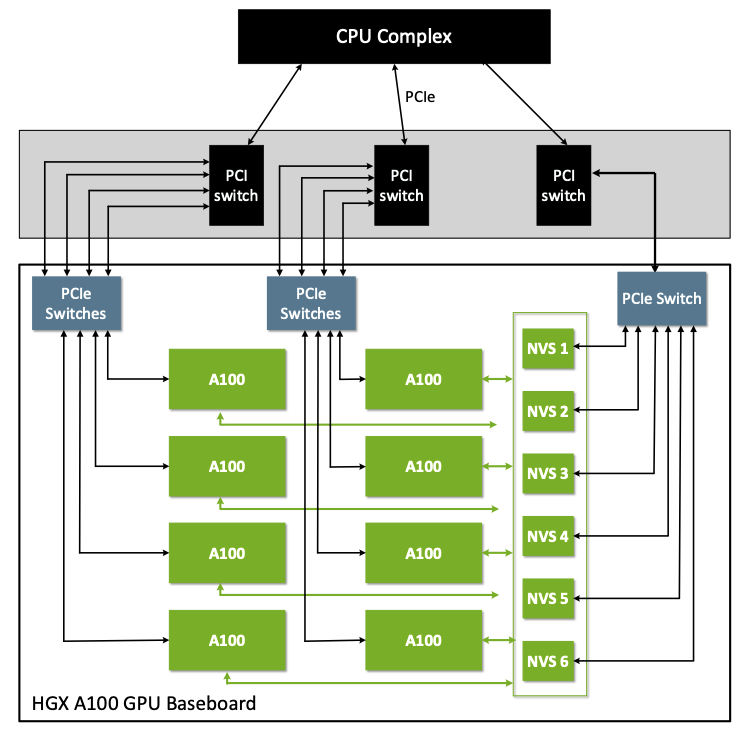

# NVIDIA Driver bring up on custom Kernel
This Documentation gives information on how to bringup NVIDIA Driver with a custom Kernel. Garden Linux is used as OS to explain the configurations and setup

There are parts in the documentation which is already implemented in the repo. Also configuratiuons for Garden Linux is already inplace. This is just a reference on how it is imeplemented / for debugging in case of issues

## Introduction to Garden Linux
Garden Linux is a Debian GNU/Linux derivate that aims to provide small, auditable Linux images for most cloud providers (e.g. AWS, Azure, GCP etc.) and bare-metal machines. Garden Linux is the best Linux for Gardener nodes. Garden Linux provides great possibilities for customizing that is made by a highly customizable feature set to fit your needs.

Garden Linux always supports latest LTS kernel.

## Introduction to gpu operator
Kubernetes provides access to special hardware resources such as NVIDIA GPUs, NICs, Infiniband adapters and other devices through the device plugin framework. However, configuring and managing nodes with these hardware resources requires configuration of multiple software components such as drivers, container runtimes or other libraries which are difficult and prone to errors. The NVIDIA GPU Operator uses the operator framework within Kubernetes to automate the management of all NVIDIA software components needed to provision GPU. These components include the NVIDIA drivers (to enable CUDA), Kubernetes device plugin for GPUs, the NVIDIA Container Toolkit, automatic node labeling using GFD, DCGM based monitoring and others.

gpu-operator allows:
 - Download of built driver image from nvcr registry and install the drivers inside OS. 
 - We can also install custom built drivers in custom location using our own container image. 
 
In this documentation. we use second approach of creating our own container image to install NVIDIA drivers in OS in custom location. This is useful when RFS is read only

## NVIDIA Drivers and License

NVIDIA provides proprietary and open kernel module. In this Documentation, we use Open Kernel Module.

### Supported GPUs with Proprietary and Open Kernel Module

Not every GPU is compatible with the open-source GPU kernel modules.

For cutting-edge platforms such as NVIDIA Grace Hopper or NVIDIA Blackwell, you must use the open-source GPU kernel modules. The proprietary drivers are unsupported on these platforms.

For newer GPUs from the Turing, Ampere, Ada Lovelace, or Hopper architectures, NVIDIA recommends switching to the open-source GPU kernel modules.

For older GPUs from the Maxwell, Pascal, or Volta architectures, the open-source GPU kernel modules are not compatible with your platform. Continue to use the NVIDIA proprietary driver.

For mixed deployments with older and newer GPUs in the same system, continue to use the proprietary driver.

## Nvidia Driver Components
To support NVIDIA GPU, we need to install 2 components at the least
### Nvidia driver module 
Driver Module to support GPU
### Fabric Manager
If there are multiple GPUs in a node, Fabric manager is required for GPU to GPU communication to provide scale the performance. This brings up NVSwitch or NVLink which is used for GPU to GPU communication

## Build nvidia driver
This is purely an example how we can do this. There are multiple ways to do it. 

We have to create a container image that
- Downloads Driver Installer
- Extract driver
- Run nvidia installer to install driver modules in custom path
- Copy required firmware files
- Download and install Fabric manager based on GPU architecture

### Download Driver Installer
NVIDIA Installer can be downloaded from https://www.nvidia.com/en-us/drivers/ --> Select OS as Linux and required GPU series

``` Ex: https://uk.download.nvidia.com/tesla/<driver-version>/NVIDIA-Linux-<arch>-<driver-version>.run ```

### Extract driver
After download , extract the driver with below options, this just extracts the driver not install it.

```bash
chmod +x NVIDIA-Linux-<arch>-<driver-version>.run
./NVIDIA-Linux-<arch>-<driver-version>.run -x -s
#This extracts a folder with below name
cd ./NVIDIA-Linux-<arch>-<driver-version>
./nvidia-installer --kernel-module-type=open --kernel-name=<kernel-name> --kernel-install-path=<custom-path>/lib/modules/<kernel-name>
```
**Note:**
- kernel-name : Name of the kernel where installer should expect kernel headers inside /usr/lib. 
- Make sure kernel headers match the system where the drivers will be installed finally. Otherwise loading driver module can result in error.

### Copy firmware files
In addition to driver module itself, firmware files need to copied to the node. When the driver module is loaded in node, it tries to load the firmware.
Make sure firmware signing is disabled in Kernel configuration [Refer Disable Firmware Signinig](#disable-firmware-signing) or sign the firmware
```bash
mkdir -p <custom-path>/lib/firmware/nvidia/<driver-version>/
cp NVIDIA-Linux-<arch>-<driver-version>/firmware/* <custom-path>/lib/firmware/nvidia/<driver-version>/
```
After these steps we have NVIDIA driver in a custom path.


Now we can create a container image with the drivers built in last step encapsulated inside the image add installation script that does following in startup ([Install driver](#install-driver) and [Install Fabric Manager](#download-and-install-fabric-manager))
### Install driver
```bash 
echo -n "<custom-path>/lib/firmware/" > /sys/module/firmware_class/parameters/path
modprobe -q -d "<custom-path>" nvidia
modprobe -q -d "<custom-path>" nvidia-uvm
<custom-path>/bin/nvidia-modprobe -u -m -c 0
```
### Download and Install Fabric Manager
Before installing Fabric manager, we need to know few things about the architecture. Please read [Architecture and Fabric Manager section](#architecture-and-fabric-manager) before doing this part

#### Download Fabric Manager
```bash
wget -O /tmp/keyring.deb https://developer.download.nvidia.com/compute/cuda/repos/debian12/x86_64/cuda-keyring_1.1-1_all.deb && dpkg -i /tmp/keyring.deb
apt-get update
apt-get install -y -V nvidia-fabricmanager-<driver-major-version>=<driver-version>
```
#### Install Fabric Manager
If the architecture includes NVSwitch then(Ex:Turing)
```bash
sed -i 's/DAEMONIZE=1/DAEMONIZE=0/g' /etc/fabricmanager.cfg
sed -i 's/LOG_FILE_NAME=.*$/LOG_FILE_NAME=/g' /etc/fabricmanager.cfg
nv-fabricmanager -c /etc/fabricmanager.cfg
```

If the architecture includes NVLink then (Ex: Blackwell)
```bash
apt-get install -y -V nvlsm
sed -i 's/DAEMONIZE=1/DAEMONIZE=0/g' /etc/fabricmanager.cfg
sed -i 's/LOG_FILE_NAME=.*$/LOG_FILE_NAME=/g' /etc/fabricmanager.cfg
/usr/bin/nvidia-fabricmanager-start.sh --mode start --fm-config-file /etc/fabricmanager.cfg
```

Note: Driver download and creation of docker image is completed handled in the repo for Garden Linux versions.

# Install drivers with gpu-operator
From above step we created a container image that compiles and installs NVIDIA driver. Next step is to pass this to gpu-operator to install on the node

gpu-operator is installed via heml chart
## Update helm values
```bash
cdi:
  enabled: true
  default: true
toolkit:
  installDir: /opt/nvidia
driver:
  imagePullPolicy: Always
  usePrecompiled: true
  version: <driver-major-version>
  repository: <container-image-name>
```
## Start gpu operator
```bash
helm repo add nvidia https://helm.ngc.nvidia.com/nvidia
helm repo update
helm upgrade --install gpu-operator nvidia/gpu-operator -n gpu-operator --create-namespace -f helm/gpu-operator-values.yaml
```

Once gpu-operator is running we should see

```bash
kubectl get pods -n gpu-operator
gardener-node-feature-discovery-worker-*               1/1     Running     
gpu-feature-discovery-*                                1/1     Running
nvidia-container-toolkit-daemonset-*                   1/1     Running
nvidia-cuda-validator-*                                0/1     Completed
nvidia-dcgm-exporter-*                                 1/1     Running
nvidia-device-plugin-daemonset-*                       1/1     Running
nvidia-driver-daemonset-6.12.72-amd64-gardenlinux0-*   1/1     Running
nvidia-mig-manager-*                                   1/1     Running
nvidia-operator-validator-*                            1/1     Running
```
## Architecture and Fabric Manager
(Refer: https://docs.nvidia.com/datacenter/tesla/fabric-manager-user-guide/index.html)

FM configures the NVSwitch memory fabrics to form one memory fabric among all participating GPUs and monitors the NVLinks that support the fabric. At a high level, FM completes the following tasks:

Configures routing (earlier than the fourth generation NVSwitch) among NVSwitch ports.

Sets up GPU routing and port map if applicable.

Coordinates with the GPU driver to initialize GPUs.

Monitors the fabric for NVLink and NVSwitch errors.

On systems that are not capable of Autonomous Link Initialization (ALI)-based NVLink training (first and second generation NVSwitch-based systems), FM complets the following tasks:

Coordinates with the NVSwitch driver to initialize and train NVSwitch-to-NVSwitch NVLink interconnects.

Coordinates with the GPU driver to initialize and train NVSwitch-to-GPU NVLink interconnects.

Based on Architecture, NVSwitch or NVLink is used.

Example A100(With NVSwitch):


This can also be confirmed with lspci
TODO: Add snapshot from A100

Example B200(with NVLink):


This can also be confirmed with lspci
```bash
lspci | grep -i -E 'connect'
```
Expected output:
```text
ab:00.0 Infiniband controller: Mellanox Technologies MT2910 Family [ConnectX-7]
```

### Check for NVLink Status (Inside Node)

When Fabric manager is not installed properly, Fabric status shows In Progress
```
/run/nvidia/driver/bin/nvidia-smi -q -i 0 | grep -i -A 2 Fabric
         Fabric
            State                   : In Progress
            Status                  : N/A
```
After successfull installation of Fabric Manager, status should be success

```
/run/nvidia/driver/bin/nvidia-smi -q -i 0 | grep -i -A 2 Fabric
    Fabric
        State                                          : Completed
        Status                                         : Success
```

## GPU Direct RDMA support
GPUDirect RDMA is a technology in NVIDIA GPUs that enables direct data exchange between GPUs and a third-party peer device using PCI Express. The third-party devices could be network interfaces such as NVIDIA ConnectX SmartNICs or BlueField DPUs, or video acquisition adapters.

We can enable GPU Direct RDMA with NVIDIA peermem module or DMABuf
If we are using nvidia peermem, then this needs to be built and loaded in the docker image install script above. Since recommended way of nvidia is to use Open Kernel Module with DMABuf, follow below steps to enable RDMA with DMABuf

### Enable Kernel Configuration 
Note : We can enable all the configurations here and the modules will be loaded based on the interfaces

- Enable RDMA support in kernel : Refer [Support RDMA](#rdma-configuration)
- Enable DMABuf : Refer [Support DMABuf section](#dmabuf-configuration)

#### Network Interfaces:
We can verify the nerwork interface using lspci . Refer [EFA support](#efa-support) and [Mlx Support](#mlx-support)

##### Mellanox Interfaces
- Enable Mlx and Infiniband drivers: Refer [Support Mlx and Infiniband drivers](#mlx-and-infiniband-driver-configurations)
##### EFA Interfaces
- If using AWS cluster, then EFA needs to be enabled. Refer [EFA support](#efa-configuration)
In addition to Kernel Configurationm, we also have to start efa plugin to support EFA Interface

When Kernel configurations are properly enabled, then just append "--set driver.rdma.useHostMofed=true" in helm command mentioned in [Start gpu operator section](#start-gpu-operator)


### EFA support
```bash
#EFA Interface
lspci | grep -i -E 'nvidia|efa'
```
Exepcted output:
```text
```
If the efa device is not shown in lspci, then AWS reservation is not done properly. We have to enable EFA network interface type during reservation/instance creatioon. Refer https://docs.aws.amazon.com/AWSEC2/latest/UserGuide/efa-start-nccl.html

### Mlx support
```bash
# Mellanox Interface
lspci | grep -i -E 'mellanox'
```
Expected output:
```text
18:00.0 Ethernet controller: Mellanox Technologies MT43244 BlueField-3 integrated ConnectX-7 network controller (rev 01)
18:00.1 DMA controller: Mellanox Technologies MT43244 BlueField-3 SoC Management Interface (rev 01)
3e:00.0 Ethernet controller: Mellanox Technologies MT43244 BlueField-3 integrated ConnectX-7 network controller (rev 01)
3e:00.1 DMA controller: Mellanox Technologies MT43244 BlueField-3 SoC Management Interface (rev 01)
ab:00.0 Infiniband controller: Mellanox Technologies MT2910 Family [ConnectX-7]
```

## Kernel Configuration 
### Disable Firmware Signing
``` CONFIG_IMA_APPRAISE_REQUIRE_FIRMWARE_SIGS=n ```
### RDMA Configuration
``` CONFIG_RDMA_CORE=y ```
### Enable Soft RoCE
``` 
CONFIG_INFINIBAND_VIRT_DMA=y
CONFIG_RDMA_RXE=m
CONFIG_INFINIBAND_IPOIB=m
CONFIG_INFINIBAND_IPOIB_CM=y
CONFIG_NET_UDP_TUNNEL=y 
```
### Mlx and Infiniband Driver Configurations
```
CONFIG_MLX4_EN=m
CONFIG_MLX4_EN_DCB=y
CONFIG_MLX4_CORE=m
CONFIG_MLX4_DEBUG=y
CONFIG_MLX4_CORE_GEN2=y
CONFIG_MLX5_CORE=m
CONFIG_MLX5_FPGA=y
CONFIG_MLX5_CORE_EN=y
CONFIG_MLX5_EN_ARFS=y
CONFIG_MLX5_EN_RXNFC=y
CONFIG_MLX5_MPFS=y
CONFIG_MLX5_ESWITCH=y
CONFIG_MLX5_BRIDGE=y
CONFIG_MLX5_CLS_ACT=y
CONFIG_MLX5_TC_CT=y
CONFIG_MLX5_TC_SAMPLE=y
CONFIG_MLX5_CORE_EN_DCB=y
CONFIG_MLX5_CORE_IPOIB=y
CONFIG_MLX5_SW_STEERING=y
CONFIG_MLX5_HW_STEERING=y
CONFIG_MLXFW=m
CONFIG_MLX4_INFINIBAND=m
CONFIG_MLX5_INFINIBAND=m
CONFIG_INFINIBAND_USER_ACCESS=m
CONFIG_INFINIBAND_ON_DEMAND_PAGING=y
CONFIG_INFINIBAND_ADDR_TRANS=y
```
### EFA Configuration
```
CONFIG_INFINIBAND_USER_ACCESS=m
CONFIG_INFINIBAND_ON_DEMAND_PAGING=y
CONFIG_INFINIBAND_ADDR_TRANS=y
CONFIG_INFINIBAND_EFA=m
CONFIG_INFINIBAND_RDMAVT=m
```
### DMABuf Configuration
```
CONFIG_DMADEVICES=y
CONFIG_VIRT_DRIVERS=y
CONFIG_PCI_P2PDMA=y
CONFIG_DMABUF_MOVE_NOTIFY=y
CONFIG_UDMABUF=y
CONFIG_HMM_MIRROR=y
CONFIG_DEVICE_PRIVATE=y
```

## Network configuration
In order to run big llm models, mtu must be set to 9216 for all the interfaces

## Memlock limit
In order to support llm models, memlimit has to be bigger

```bash
/etc/systemd/system/containerd.service.d/override.conf
[Service]
LimitMEMLOCK=infinity
```

Restart daemon
```bash
systemctl daemon-reload
systemctl restart containerd
```

## Kernel Parameter to suport DMABuf
In order to support DMABuf , iommu have to be dsiabled. This can be done by appending kernel parameter with

``` iommu=pt intel_iommu=off ```

If this is not set , then can lead to issue (https://docs.nvidia.com/deeplearning/nccl/user-guide/docs/troubleshooting.html#:~:text=PCI%20Access%20Control%20Services%20(ACS))

## NCCL
### Dockerfile to build container image with nccl, nccl-test, efa support
<details>
<summary><b>nccl conatainer image</b></summary>

```
ARG CUDA_VERSION=12.9.1
ARG BASE_IMAGE=nvidia/cuda:${CUDA_VERSION}-devel-ubuntu22.04
FROM ${BASE_IMAGE} AS base

ARG DEBIAN_FRONTEND=noninteractive
RUN apt-get -qq update && \
    apt-get -qq install -y \
    --allow-change-held-packages \
    --no-install-recommends \
    --allow-downgrades \
    build-essential \
    wget devscripts debhelper fakeroot pkg-config check openssh-server \
    libopenmpi-dev \
    openmpi-bin \
    git \
    libtool \
    autoconf \
    automake \
    curl

# Install EFA installer
RUN cd /tmp && \
    curl -O https://efa-installer.amazonaws.com/aws-efa-installer-latest.tar.gz && \
    tar -xf aws-efa-installer-latest.tar.gz && \
    cd aws-efa-installer && \
    # Install EFA without kernel modules (not needed in container)
    ./efa_installer.sh -y --skip-kmod --skip-limit-conf --no-verify --mpi=openmpi4 && \
    cd / && \
    rm -rf /tmp/aws-efa-installer*

FROM base AS libnccl2

# NCCL with EFA plugin
ARG TARGET_NCCL_VERSION='2.28.3-1'
ARG AWS_OFI_NCCL_VERSION='v1.18.0'

# Build NCCL
RUN mkdir /tmp/build && \
    cd /tmp/build && \
    wget -qO- "https://github.com/NVIDIA/nccl/archive/refs/tags/v${TARGET_NCCL_VERSION}.tar.gz" \
    | tar --strip-components=1 -xzf - && \
    make -j20 pkg.debian.build NVCC_GENCODE="-gencode=arch=compute_80,code=sm_80 -gencode=arch=compute_90,code=sm_90 -gencode=arch=compute_100,code=sm_100" && \
    cd build/pkg/deb && \
    ls -l && \
    mkdir /tmp/libnccl2 && \
    mv ./libnccl*.deb /tmp/libnccl2/ && \
    cd /tmp && \
    rm -r /tmp/build

# Build AWS OFI NCCL plugin
RUN cd /tmp && \
    git clone https://github.com/aws/aws-ofi-nccl.git -b ${AWS_OFI_NCCL_VERSION} && \
    cd aws-ofi-nccl && \
    ./autogen.sh && \
    CXXFLAGS="-Wno-cast-function-type" ./configure --prefix=/opt/aws-ofi-nccl \
        --with-libfabric=/opt/amazon/efa \
        --with-cuda=/usr/local/cuda \
        --enable-platform-aws && \
    make -j20 && \
    make install && \
    cd / && \
    rm -rf /tmp/aws-ofi-nccl

FROM base AS base-amd64
RUN --mount=type=bind,from=libnccl2,source=/tmp/libnccl2,target=/tmp/install \
    cd /tmp/install && dpkg -i *.deb

# Copy AWS OFI NCCL plugin
COPY --from=libnccl2 /opt/aws-ofi-nccl /opt/aws-ofi-nccl

FROM base-amd64

ENV NCCL_TESTS_COMMITISH=2535da805b34e96d1dc08be66289be1a6d57f5ad

WORKDIR /opt/nccl-tests

RUN wget -q -O - https://github.com/NVIDIA/nccl-tests/archive/${NCCL_TESTS_COMMITISH}.tar.gz | tar --strip-components=1 -xzf - && \
    make -j20 MPI=1 MPI_HOME=/usr/lib/x86_64-linux-gnu/openmpi && \
    ln -s /opt/nccl-tests /opt/nccl_tests

# SSH dependencies for MPI
RUN sed -i 's/[ #]*\(.*StrictHostKeyChecking \).*/\1no/g' /etc/ssh/ssh_config
RUN echo "    UserKnownHostsFile /dev/null" >> /etc/ssh/ssh_config
RUN sed -i 's/#\(StrictModes \).*/\1no/g' /etc/ssh/sshd_config
RUN mkdir /var/run/sshd -p
```
</details>

### Yaml file to start nccl container 
<details>
<summary><b>Pod Definition</b></summary>

```yaml
apiVersion: kubeflow.org/v2beta1
kind: MPIJob
metadata:
  name: nccl-test-72-gb200-8n-roce
spec:
  slotsPerWorker: 8
  runPolicy:
    cleanPodPolicy: Running
  mpiReplicaSpecs:
    Launcher:
      replicas: 1
      template:
        metadata:
        spec:
          hostNetwork: true
          dnsPolicy: ClusterFirstWithHostNet
          containers:
            - name: nccl
              image: ghcr.io/coreweave/nccl-tests:13.1.0-devel-ubuntu24.04-nccl2.29.2-1-9dd6f94 
              command: ["/bin/bash", "-c"]
              args:
                - |
                  # Copy SSH keys with correct permissions
                  mount -o remount,rw /root/.ssh
                  cp -rL /mnt/ssh-secret/* /root/.ssh/
                  chmod 700 /root/.ssh
                  chmod 600 /root/.ssh/id_rsa
                  chmod 644 /root/.ssh/id_rsa.pub /root/.ssh/authorized_keys 2>/dev/null || true
                  sed -i 's/^Port 22$/Port 2222/; s/^#Port 22$/Port 2222/' /etc/ssh/sshd_config
                  sleep infinity 
              env:
                - name: OMPI_ALLOW_RUN_AS_ROOT
                  value: "1"
                - name: OMPI_ALLOW_RUN_AS_ROOT_CONFIRM
                  value: "1"
                - name: OMPI_MCA_plm_rsh_args
                  value: "-p 2222"
                - name: LD_LIBRARY_PATH
                  value: "/usr/local/cuda/lib64:/run/nvidia/driver/lib:/run/nvidia/driver/usr/lib/x86_64-linux-gnu:${LD_LIBRARY_PATH}"
              resources:
                requests:
                  cpu: 2
                  memory: 32Gi
                limits:
                  memory: 64Gi
              securityContext:
                privileged: true
              volumeMounts:                          
                - name: ssh-secret
                  mountPath: /mnt/ssh-secret
                  readOnly: true
                - name: nvidia-driver-bin
                  mountPath: /usr/local/nvidia/bin
                  readOnly: true
                - name: nvidia-driver-lib
                  mountPath: /run/nvidia/driver
                  readOnly: true
                - name: dshm
                  mountPath: /dev/shm 
          volumes:                                  
            - name: ssh-secret
              secret:
                secretName: nccl-test-72-gb200-8n-roce-ssh
                defaultMode: 0600
            - name: nvidia-driver-bin
              hostPath:
                path: /run/nvidia/driver/bin
                type: Directory
            - name: nvidia-driver-lib
              hostPath:
                path: /run/nvidia/driver
                type: Directory
            - name: dshm                       
              emptyDir:                       
                medium: Memory                  
                sizeLimit: 300Gi  
          restartPolicy: Never

    Worker:
      replicas: 2
      template:
        metadata:
          labels:
            metadata.coreweave.cloud/job: nccl-test
          annotations:
            io.kubernetes.cri.shm-size: "500Gi"
        spec:
          hostNetwork: true
          dnsPolicy: ClusterFirstWithHostNet
          affinity:
            podAntiAffinity:
              requiredDuringSchedulingIgnoredDuringExecution:
                - labelSelector:
                    matchLabels:
                      training.kubeflow.org/job-name: nccl-test-72-gb200-8n-roce
                      training.kubeflow.org/replica-type: worker
                  topologyKey: kubernetes.io/hostname
          containers:
            - name: nccl
              image: ghcr.io/coreweave/nccl-tests:13.1.0-devel-ubuntu24.04-nccl2.29.2-1-9dd6f94
              command: ["/bin/bash", "-c"]
              args:
                - |
                  mount -o remount,rw /root/.ssh
                  cp -rL /mnt/ssh-secret/* /root/.ssh/
                  chmod 700 /root/.ssh
                  chmod 600 /root/.ssh/id_rsa
                  chmod 644 /root/.ssh/id_rsa.pub /root/.ssh/authorized_keys 2>/dev/null || true
                  
                  sed -i 's/^Port 22$/Port 2222/; s/^#Port 22$/Port 2222/' /etc/ssh/sshd_config
                  service ssh start && sleep infinity
              env:
                - name: LD_LIBRARY_PATH
                  value: "/usr/local/cuda/lib64:/run/nvidia/driver/lib:/run/nvidia/driver/usr/lib/x86_64-linux-gnu:${LD_LIBRARY_PATH}"
              resources:
                requests:
                  nvidia.com/gpu: 8
                  memory: 1500Gi
                limits:
                  nvidia.com/gpu: 8
                  memory: 1500Gi
              volumeMounts:
                - mountPath: /dev/shm
                  name: dshm
                - mountPath: /dev/infiniband
                  name: infiniband
                - name: ssh-secret                  
                  mountPath: /mnt/ssh-secret
                  readOnly: true
                - name: nvidia-driver-bin
                  mountPath: /usr/local/nvidia/bin
                  readOnly: true
                - name: nvidia-driver-lib
                  mountPath: /run/nvidia/driver
                  readOnly: true
              securityContext:
                privileged: true
          volumes:
            - emptyDir:
                medium: Memory
                sizeLimit: 500Gi
              name: dshm
            - hostPath:
                path: /dev/infiniband
                type: Directory
              name: infiniband
            - name: ssh-secret                       
              secret:
                secretName: nccl-test-72-gb200-8n-roce-ssh
                defaultMode: 0600
            - name: nvidia-driver-bin
              hostPath:
                path: /run/nvidia/driver/bin
                type: Directory
            - name: nvidia-driver-lib
              hostPath:
                path: /run/nvidia/driver
                type: Directory
```
</details>
Note this test is using host network in privileged mode. It is less secure. We should use SRIOV instead with NVIDIA network operator


### Basic RDMA communication btwn nodes
#### RDMA Test Pod Configuration

<details>
<summary><b>Node1</b></summary>

```yaml
apiVersion: v1
kind: Pod
metadata:
  name: rdma-test-node1
spec:
  nodeSelector:
    kubernetes.io/hostname: <node1>
  restartPolicy: OnFailure
  hostNetwork: true
  containers:
  - name: rdma-test
    image: mellanox/cuda-perftest
    securityContext:
      privileged: true
      capabilities:
        add: [ "IPC_LOCK" ]
    resources:
      limits:
        nvidia.com/gpu: 1
      requests:
        nvidia.com/gpu: 1
    volumeMounts:
    - name: dev-infiniband
      mountPath: /dev/infiniband
    - name: sys
      mountPath: /sys
    command: ["sleep", "infinity"]
  volumes:
  - name: dev-infiniband
    hostPath:
      path: /dev/infiniband
      type: DirectoryOrCreate
  - name: sys
    hostPath:
      path: /sys
      type: Directory
```
</details>
<details>
<summary><b>Node2</b></summary>

```yaml
apiVersion: v1
kind: Pod
metadata:
  name: rdma-test-node2
spec:
  nodeSelector:
    kubernetes.io/hostname: <node2>
  restartPolicy: OnFailure
  hostNetwork: true
  containers:
  - name: rdma-test
    image: mellanox/cuda-perftest
    securityContext:
      privileged: true
      capabilities:
        add: [ "IPC_LOCK" ]
    resources:
      limits:
        nvidia.com/gpu: 1
      requests:
        nvidia.com/gpu: 1
    volumeMounts:
    - name: dev-infiniband
      mountPath: /dev/infiniband
    - name: sys
      mountPath: /sys
    command: ["sleep", "infinity"]
  volumes:
  - name: dev-infiniband
    hostPath:
      path: /dev/infiniband
      type: DirectoryOrCreate
  - name: sys
    hostPath:
      path: /sys
      type: Directory
```
</details>

##### Start pods
```bash
kubectl apply -f <rdma_test_node1.yaml> -n rdma-test
kubectl apply -f <rdma_test_node2.yaml> -n rdma-test
```

##### Run test inside pod
**In Terminal 1 (server):**
```bash
kubectl exec -it rdma-test-node1 -n rdma-test -- ib_write_bw --use_cuda=0 --use_cuda_dmabuf \
    -d mlx5_0 -a -F --report_gbits -q 1
```
**Output**
```
************************************
* Waiting for client to connect... *
************************************
```

**In Terminal 2 (client):**
```bash
kubectl exec -it rdma-test-node2 -n rdma-test -- ib_write_bw --use_cuda=0 --use_cuda_dmabuf \
    -d mlx5_0 -a -F --report_gbits -q 1 <ip_address>
```
**Output**
```
---------------------------------------------------------------------------------------
                    RDMA_Write BW Test
 Dual-port       : OFF		Device         : mlx5_0
 Number of qps   : 1		Transport type : IB
 Connection type : RC		Using SRQ      : OFF
 PCIe relax order: ON
 ibv_wr* API     : ON
 CQ Moderation   : 1
 Mtu             : 4096[B]
 Link type       : Ethernet
 GID index       : 3
 Max inline data : 0[B]
 rdma_cm QPs	 : OFF
 Data ex. method : Ethernet
---------------------------------------------------------------------------------------
 local address: LID 0000 QPN 0x0e2e PSN 0xf3aa42 RKey 0x186dc0 VAddr 0x007fad682b4000
 GID: 00:00:00:00:00:00:00:00:00:00:255:255:10:00:01:11
 remote address: LID 0000 QPN 0x1d81 PSN 0xe9c73e RKey 0x186d4a VAddr 0x007f62137fa000
 GID: 00:00:00:00:00:00:00:00:00:00:255:255:10:00:01:12
---------------------------------------------------------------------------------------
 #bytes     #iterations    BW peak[Gb/sec]    BW average[Gb/sec]   MsgRate[Mpps]        BW min[Gb/sec]
 65536      5000             368.67             368.48 		   0.702829		  0.00
---------------------------------------------------------------------------------------
```
Test can be repeated for other rdma interfaces
### Run All reduce test
#### Start mpi operator 
```
kubectl apply -f https://raw.githubusercontent.com/kubeflow/mpi-operator/v0.3.0/deploy/v2beta1/mpi-operator.yaml
```

#### Configuration file
<details>
<summary><b>Pod Definition</b></summary>

```yaml
apiVersion: kubeflow.org/v2beta1
kind: MPIJob
metadata:
  name: nccl-test-72-gb200-8n-roce
spec:
  slotsPerWorker: 8
  runPolicy:
    cleanPodPolicy: Running
  mpiReplicaSpecs:
    Launcher:
      replicas: 1
      template:
        metadata:
        spec:
          hostNetwork: true
          dnsPolicy: ClusterFirstWithHostNet
          containers:
            - name: nccl
              image: ghcr.io/coreweave/nccl-tests:13.1.0-devel-ubuntu24.04-nccl2.29.2-1-9dd6f94 
              command: ["/bin/bash", "-c"]
              args:
                - |
                  # Copy SSH keys with correct permissions
                  mount -o remount,rw /root/.ssh
                  cp -rL /mnt/ssh-secret/* /root/.ssh/
                  chmod 700 /root/.ssh
                  chmod 600 /root/.ssh/id_rsa
                  chmod 644 /root/.ssh/id_rsa.pub /root/.ssh/authorized_keys 2>/dev/null || true
                  sed -i 's/^Port 22$/Port 2222/; s/^#Port 22$/Port 2222/' /etc/ssh/sshd_config
                  sleep infinity 
              env:
                - name: OMPI_ALLOW_RUN_AS_ROOT
                  value: "1"
                - name: OMPI_ALLOW_RUN_AS_ROOT_CONFIRM
                  value: "1"
                - name: OMPI_MCA_plm_rsh_args
                  value: "-p 2222"
                - name: LD_LIBRARY_PATH
                  value: "/usr/local/cuda/lib64:/run/nvidia/driver/lib:/run/nvidia/driver/usr/lib/x86_64-linux-gnu:${LD_LIBRARY_PATH}"
              resources:
                requests:
                  cpu: 2
                  memory: 32Gi
                limits:
                  memory: 64Gi
              securityContext:
                privileged: true
              volumeMounts:                          
                - name: ssh-secret
                  mountPath: /mnt/ssh-secret
                  readOnly: true
                - name: nvidia-driver-bin
                  mountPath: /usr/local/nvidia/bin
                  readOnly: true
                - name: nvidia-driver-lib
                  mountPath: /run/nvidia/driver
                  readOnly: true
                - name: dshm
                  mountPath: /dev/shm 
          volumes:                                  
            - name: ssh-secret
              secret:
                secretName: nccl-test-72-gb200-8n-roce-ssh
                defaultMode: 0600
            - name: nvidia-driver-bin
              hostPath:
                path: /run/nvidia/driver/bin
                type: Directory
            - name: nvidia-driver-lib
              hostPath:
                path: /run/nvidia/driver
                type: Directory
            - name: dshm                       
              emptyDir:                       
                medium: Memory                  
                sizeLimit: 300Gi  
          restartPolicy: Never

    Worker:
      replicas: 2
      template:
        metadata:
          labels:
            metadata.coreweave.cloud/job: nccl-test
          annotations:
            io.kubernetes.cri.shm-size: "500Gi"
        spec:
          hostNetwork: true
          dnsPolicy: ClusterFirstWithHostNet
          affinity:
            podAntiAffinity:
              requiredDuringSchedulingIgnoredDuringExecution:
                - labelSelector:
                    matchLabels:
                      training.kubeflow.org/job-name: nccl-test-72-gb200-8n-roce
                      training.kubeflow.org/replica-type: worker
                  topologyKey: kubernetes.io/hostname
          containers:
            - name: nccl
              image: ghcr.io/coreweave/nccl-tests:13.1.0-devel-ubuntu24.04-nccl2.29.2-1-9dd6f94
              command: ["/bin/bash", "-c"]
              args:
                - |
                  mount -o remount,rw /root/.ssh
                  cp -rL /mnt/ssh-secret/* /root/.ssh/
                  chmod 700 /root/.ssh
                  chmod 600 /root/.ssh/id_rsa
                  chmod 644 /root/.ssh/id_rsa.pub /root/.ssh/authorized_keys 2>/dev/null || true
                  
                  sed -i 's/^Port 22$/Port 2222/; s/^#Port 22$/Port 2222/' /etc/ssh/sshd_config
                  service ssh start && sleep infinity
              env:
                - name: LD_LIBRARY_PATH
                  value: "/usr/local/cuda/lib64:/run/nvidia/driver/lib:/run/nvidia/driver/usr/lib/x86_64-linux-gnu:${LD_LIBRARY_PATH}"
              resources:
                requests:
                  nvidia.com/gpu: 8
                  memory: 1500Gi
                limits:
                  nvidia.com/gpu: 8
                  memory: 1500Gi
              volumeMounts:
                - mountPath: /dev/shm
                  name: dshm
                - mountPath: /dev/infiniband
                  name: infiniband
                - name: ssh-secret                  
                  mountPath: /mnt/ssh-secret
                  readOnly: true
                - name: nvidia-driver-bin
                  mountPath: /usr/local/nvidia/bin
                  readOnly: true
                - name: nvidia-driver-lib
                  mountPath: /run/nvidia/driver
                  readOnly: true
              securityContext:
                privileged: true
          volumes:
            - emptyDir:
                medium: Memory
                sizeLimit: 500Gi
              name: dshm
            - hostPath:
                path: /dev/infiniband
                type: Directory
              name: infiniband
            - name: ssh-secret                       
              secret:
                secretName: nccl-test-72-gb200-8n-roce-ssh
                defaultMode: 0600
            - name: nvidia-driver-bin
              hostPath:
                path: /run/nvidia/driver/bin
                type: Directory
            - name: nvidia-driver-lib
              hostPath:
                path: /run/nvidia/driver
                type: Directory
```
</details>
Note this test is using host network in privileged mode. It is less secure. We should use SRIOV instead with NVIDIA network operator

#### Run test pods
```bash
kubectl apply -f nccl-test.yaml -n nccl-tests
```
#### Observer pods running
```
kubectl get pods -n nccl-tests

kubectl get pods -n nccl-tests
NAME                                       READY   STATUS    RESTARTS   AGE
nccl-test-72-gb200-8n-roce-launcher-*                1/1     Running   0          4m39s
nccl-test-72-gb200-8n-roce-worker-0         1/1     Running   0          4m39s
nccl-test-72-gb200-8n-roce-worker-1         1/1     Running   0          4m39s
```

#### Run mpirun command inside launcher
```
kubectl exec -it -n nccl-tests nccl-test-72-gb200-8n-roce-launcher-* -- bash
```
**For Intra node**
```
mpirun -np 8 -N 8 --bind-to none --map-by slot \
  --mca oob_tcp_if_include <mngt_interface>  \
  --mca btl_tcp_if_include <mgmt_interface>   \
  --mca pml ucx   \
  --mca plm_rsh_args "-p 2222 -o StrictHostKeyChecking=no -o UserKnownHostsFile=/dev/null"  \
  --hostfile /etc/mpi/hostfile   \
  -x LD_LIBRARY_PATH   \
  -x NCCL_DEBUG=INFO   \
  -x NCCL_DEBUG_SUBSYS=NET,INET,GRAPH   \
  -x NCCL_IB_GID_INDEX=3 \
  -x NCCL_SOCKET_IFNAME=<mgmt_interface>   \
  -x OMPI_MCA_coll_hcoll_enable=0   \
  -x NCCL_IB_HCA=^mlx5_2,mlx5_6,mlx5_7,mlx5_8,mlx5_9 \
  -x UCX_NET_DEVICES=mlx5_0:1,mlx5_1:1,mlx5_3:1,mlx5_4:1,mlx5_5:1,mlx5_10:1,mlx5_11:1,mlx5_12:1 \
  /opt/nccl_tests/build/all_reduce_perf -b 16G -e 64G -f 2 -g 1
```
**Output**


**For Inter node**
```
mpirun -np 16 -N 8 --bind-to none --map-by slot \
  --mca oob_tcp_if_include <mngt_interface>  \
  --mca btl_tcp_if_include <mgmt_interface>   \
  --mca pml ucx   \
  --mca plm_rsh_args "-p 2222 -o StrictHostKeyChecking=no -o UserKnownHostsFile=/dev/null"  \
  --hostfile /etc/mpi/hostfile   \
  -x LD_LIBRARY_PATH   \
  -x NCCL_DEBUG=INFO   \
  -x NCCL_DEBUG_SUBSYS=NET,INET,GRAPH   \
  -x NCCL_IB_GID_INDEX=3 \
  -x NCCL_SOCKET_IFNAME=<mgmt_interface>   \
  -x OMPI_MCA_coll_hcoll_enable=0   \
  -x NCCL_IB_HCA=^mlx5_2,mlx5_6,mlx5_7,mlx5_8,mlx5_9 \
  -x UCX_NET_DEVICES=mlx5_0:1,mlx5_1:1,mlx5_3:1,mlx5_4:1,mlx5_5:1,mlx5_10:1,mlx5_11:1,mlx5_12:1 \
  /opt/nccl_tests/build/all_reduce_perf -b 16G -e 64G -f 2 -g 1
```
**Output*


## References
gpu operator : https://docs.nvidia.com/datacenter/cloud-native/gpu-operator/latest/overview.html
Fabric Manager : https://docs.nvidia.com/datacenter/tesla/fabric-manager-user-guide/index.html
Dynamo/Grove : 
               https://developer.nvidia.com/blog/streamline-complex-ai-inference-on-kubernetes-with-nvidia-grove/
               https://github.com/ai-dynamo/dynamo/blob/main/docs/kubernetes/README.md
RDMA : https://docs.nvidia.com/datacenter/cloud-native/gpu-operator/latest/gpu-operator-rdma.html
Soft RoCE : https://enterprise-support.nvidia.com/s/article/howto-configure-soft-roce